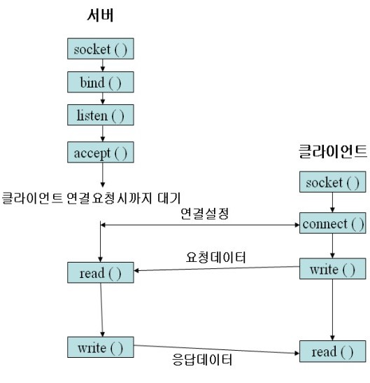
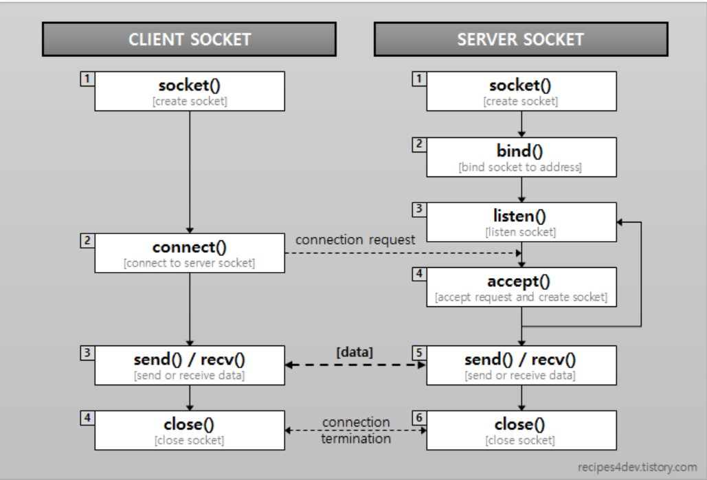

# 웹 서버

- [웹 서버](#웹-서버)
  - [들어가며](#들어가며)
  - [`Socket.accept()` 의 시점 정리](#socketaccept-의-시점-정리)
    - [서버 애플리케이션의 구조](#서버-애플리케이션의-구조)
  - [같은 포트 번호, 여러 개 소켓의 의미](#같은-포트-번호-여러-개-소켓의-의미)
    - [여러 개 소켓 처리 방식](#여러-개-소켓-처리-방식)
  - [HTTP 버전별 특징](#http-버전별-특징)
  - [참고 문헌](#참고-문헌)

## 들어가며

이번 주차는 9주차 웹 브라우저와 동일한 내용이 많다.

웹 서버와 연관지으면서 놓친 부분과 챕터의 내용과 관련된 경험을 기술하였다.

## `Socket.accept()` 의 시점 정리

정리에 앞서 `소켓 연결 과정`의 서버측 메소드별 역할을 잠시 짚어보자.

    socket(): 제어 정보를 기록한 메모리 영역(소켓)을 확보
    bind():   소켓에 포트 번호를 기록
    listen(): 소켓에 기다리는 상태를 기록
    accept(): 접속을 접수
    ...

네트워크 프로그래밍 수업에서 `소켓 연결 과정`에 대해 다음과 같은 질문을 교수님께 한 적이 있다.

<table>
  <tr>
    <th>교안</th>
    <th>이해된 자료</th>
  </tr>
  <tr>
    <td>
      <code>서버의 accept()</code>가 <code>클라이언트의 connect()</code> 이전이다.
    </td>
    <td>
      <code>서버의 accept()</code>가 <code>클라이언트의 connect()</code> 이후다.
    </td>
  </tr>
  <tr>
    <td></td>
    <td></td>
  </tr>  
</table>

교재를 통해 교안이 맞았음을 알게되었고, 해당 교안을 고도화시켰다.

`서버의 accept()` 호출 시점은 서버측이 패킷을 기다리는 상태를 의미한다.

 클라이언트측으로 부터 접속 패킷이 도착하는 시점 부터 응답 패킷을 반송하는 접속 접수 동작이 이루어지는 것이다.

### 서버 애플리케이션의 구조

서버는 클라이언트의 접속을 기다리는 소켓과
 
`서버의 accept()`마다 전자를 복제하여 각 클라이언트의 통신을 담당하는 소켓들로 나눠진다.

이 구조는 여러 클라이언트의 접근에 대한 여러 프로그램의 처리를 `동시에 작업되 보이도록` 또는 `동시에 작업되도록` 한다.

## 같은 포트 번호, 여러 개 소켓의 의미

이번 챕터를 통해 새롭게 알게된 사실이다.

어떻게 보면 놓친 부분이라 할 수 있다.

현재까지 포트 번호에 대해 다음과 같이 생각했었다.

    포트 번호는 소켓 한개를 담당

    포트 번호당 PC의 프로그램 한개를 담당

하나의 프로그램을 여러 클라이언트가 사용하기 위해서 이전 생각을 재정립할 필요가 있다.

    포트 번호는 PC의 프로그램을 식별할 뿐이다.
    
    프로토콜 스택은 포트 번호를 식별해 접속하는 클라이언트 별로 다른 소켓을 부여한다.

다음은 클라이언트 별 다른 소켓을 부여하는 기준이다.

| 서버 IP 주소 | 서버 포트 번호 | 클라이언트 IP 주소 | 클라이언트 포트 번호 | 프로그램 |
| :----------: | :------------: | :----------------: | :------------------: | :------: |
|  10.10.30.1  |       80       |     20.10.10.1     |       미사용값       | 웹 서버  |
|  10.10.30.1  |       80       |     30.10.10.1     |       미사용값       | 웹 서버  |

또한, 학부 수업에서 사용해본 소켓 처리 방식을 떠올릴 수 있었다.

### 여러 개 소켓 처리 방식

멀티스레드 방식에서 소켓당 여러 스레드를 사용했고,

비동기 방식에서 스레드 한개에 여러 소켓을 사용했다.

##  HTTP 버전별 특징

    ...

## 참고 문헌

[소켓 프로그래밍 동기와 비동기 차이](https://okky.kr/article/562664) ━ *Okky*