# 웹 서버

- [웹 서버](#웹-서버)
  - [들어가며](#들어가며)
  - [`Socket.accept()` 의 시점 정리](#socketaccept-의-시점-정리)
  - [같은 포트 번호, 여러 개 소켓의 의미](#같은-포트-번호-여러-개-소켓의-의미)
    - [서버 애플리케이션의 구조](#서버-애플리케이션의-구조)
    - [본문](#본문)
    - [여러 개 소켓 처리 방식](#여러-개-소켓-처리-방식)
  - [HTTP 버전별 특징](#http-버전별-특징)
    - [요청-응답 상세](#요청-응답-상세)
    - [리소스 요청 예측](#리소스-요청-예측)
  - [참고 문헌](#참고-문헌)

## 들어가며

이번 주차는 9주차 웹 브라우저와 동일한 내용이 많다.

웹 서버와 연관지으면서 놓친 부분과 챕터의 내용과 관련된 경험을 기술하였다.

## `Socket.accept()` 의 시점 정리

정리에 앞서 `소켓 연결 과정`의 서버측 메소드별 역할을 잠시 짚어보자.

    socket():         제어 정보를 기록한 메모리 영역(소켓)을 확보
    bind():           소켓에 포트 번호를 기록
    listen():         소켓에 기다리는 상태를 기록
    accept():         접속을 접수
    send() / recv():  데이터 송·수신
    close():          소켓 말소

네트워크 프로그래밍 수업에서 `소켓 연결 과정`에 대해 다음과 같은 질문을 교수님께 한 적이 있다.

<table>
  <tr>
    <th>교안</th>
    <th>이해된 자료</th>
  </tr>
  <tr>
    <td>
      <code>서버의 accept()</code>가 <code>클라이언트의 connect()</code> 이전이다.
    </td>
    <td>
      <code>서버의 accept()</code>가 <code>클라이언트의 connect()</code> 이후다.
    </td>
  </tr>
  <tr>
    <td></td>
    <td></td>
  </tr>  
</table>

당시 답변은 둘다 맞다고 들었다.

`서버의 listen()`은 접속 패킷을 받는 큐를 생성하는 역할이다.

`서버의 accept()`는 큐에서 꺼내는 행위이다.

따라서 큐에서 꺼내기 이전과 이후 모두 각 `클라이언트의 connect()`는 이루어진다.

## 같은 포트 번호, 여러 개 소켓의 의미

### 서버 애플리케이션의 구조

서버는 클라이언트의 접속을 기다리는 소켓과
 
`서버의 accept()`마다 전자를 복제하여 각 클라이언트의 통신을 담당하는 소켓들로 나눠진다.

이 구조는 여러 클라이언트의 접근에 대한 여러 프로그램의 처리를 `동시에 작업되 보이도록` 또는 `동시에 작업되도록` 한다.

### 본문

이번 챕터를 통해 새롭게 알게된 사실이다.

어떻게 보면 놓친 부분이라 할 수 있다.

<table>
<tr>
  <th colspan="2">포트 번호</th>
</tr>
<tr>
  <td align="center">이전 이해한 정의</td>
  <td align="center">재정립한 정의</td>
</tr>
<tr>
  <td>

클라이언트와 서버 구분 없이 포트 번호는

    소켓 한개를 담당

    이는 PC의 프로그램 한개를 담당

  </td>
  <td>

    
클라이언트 측의 포트 번호는
    
    소켓 한개를 담당

서버 측의 포트 번호는

    PC의 프로그램을 식별하는 용도며,
    
    프로토콜 스택이 포트 번호를 식별해 접속하는 클라이언트 별로 다른 소켓을 부여

  </td>
</tr>
</table>
    
다음은 클라이언트 별 다른 소켓을 부여하는 기준이다.

| 서버 IP 주소 | 서버 포트 번호 | 클라이언트 IP 주소 | 클라이언트 포트 번호 | 프로그램 |
| :----------: | :------------: | :----------------: | :------------------: | :------: |
|  10.10.30.1  |       80       |     20.10.10.1     |       미사용값       | 웹 서버  |
|  10.10.30.1  |       80       |     30.10.10.1     |       미사용값       | 웹 서버  |

### 여러 개 소켓 처리 방식

이전 목차를 통해 학부 수업에서 사용해본 소켓 처리 방식을 떠올릴 수 있었다.

멀티스레드 방식에서 소켓당 하나의 스레드를 사용해 여러 스레드를 사용했고,

    10명의 클라이언트 / 10개의 스레드

비동기 방식에서는 스레드 한개에 여러 소켓을 사용했다.

    10명의 클라이언트 / 1개의 스레드 + 제한된 n개의 스레드

    1개의 스레드는 클라이언트의 접속을 담당하는 역할

    n개의 스레드는 클라이언트의 통신을 담당하는 역할

학부 수업에서 해본 비동기 방식은 "*대리자를 사용한 비동기 프로그래밍*"이다.

대리자를 사용하면 비동기 방식으로 동기 메서드를 호출할 수 있다.

> 이 부분이 대리자를 사용한 맹점은 아니라고 판단한다. 그 맹점은 파악하지 못했다.

또한, 스레드풀의 스레드를 사용하는 방식이다.

    스레드 개수에 제한을 둬서 한번에 만들어놓고, 

    비동기 작업이 생길 때마다 스레드 풀에서 스레드를 꺼내와 사용하고 작업이 끝나면 소멸하지 않고 스레드풀에 반납하는 방식이다.

    이는, 스레드의 생성, 소멸 비용을 최소화할 수 있다.

동작과정은 이렇다.

1. 클라이언트로 I/O 요청이 동시 발생시, `BeginAccept()`를 호출하여 백그라운드의 스레드풀에게 작업을 시작하게 한다.

2. 백그라운드의 스레드풀은 `IAsyncResult 객체`를 즉시 리턴함으로써, 애플리케이션은 다음 I/O를 바로 받을 수 있다.

3. `IAsyncResult 객체` 인스턴스는 소켓 한개의 비동기 작업의 상태를 알고 있으며,

    비동기 작업의 결과값은 `EndAccpet()`에 `IAsyncResult`인스턴스를 매개변수로 담아 호출함으로써 받아올 수 있다.

4. 완료된 작업 순서대로 클라이언트에게 I/O 요청에 대한 응답 메세지를 준다.

##  HTTP 버전별 특징

<table>
  <tr>
    <th colspan="2"></th>    
    <th>1.0</th>
    <th colspan="2">1.1</th>
    <th colspan="2">2.0</th>
  </tr>
  <tr>
    <td colspan="2"></td>
    <td></td>
    <td></td>
    <td></td>
    <td></td>
    <td></td>
  </tr>
  <tr>
    <td rowspan="3">특징</td>
    <td>요청별 응답 순서</td>
    <td colspan="3" align="center">순차</td>    
    <td colspan="2" align="center">랜덤</td>    
  </tr>
  <tr>
    <td>요청-응답</td>
    <td colspan="2" align="center">핑퐁</td>    
    <td>파이프라이닝</td>
    <td>멀티플렉싱 스트림</td>
    <td>서버 푸시</td>
  </tr>
  <tr>
    <td>요청 처리</td>
    <td>Connection당 하나의 요청 처리</td>
    <td colspan="2">
      Connection당 여러 요청 순차 처리 
      (HTTP 헤더 <code>keep-alive</code>필드)
    </td>    
    <td colspan="2">
      Connection당 여러 요청 랜덤 처리     
    </td>
  </tr>  
</table>

> 윈도우 제어 방식의 패킷 최소화도 병목현상을 처리하지 못했기 때문에,
  1.x버전에서만 지원한다고 생각한다.

### 요청-응답 상세

**HTTP 1.1**

한 개의 Connection 안의 여러 개의 요청-응답이 가능해도

앞 순서의 응답에 대한 병목현상이 있다.

**HTTP 2.0**

요청-응답이 스트림을 통해 보내진다.

스트림은

    식별자가 있는 데이터를 의미한다.

스트림 생성은

    한 Connection 안에서 TCP 연결 없이 일방적으로 만듬으로써, 시간 절약한다.

한 개의 스트림이 하나의 요청-응답을 맡는다.

한 개의 Connection 위에 여러 개의 스트림이 동시에 만들어질 수 있다.

즉, 여러 개의 요청-응답을 동시 처리할 수 있다.

스트림 간에는 우선순위를 설정할 수 있어, 중요한 리소스를 먼저 받도록 할 수 있다.

    cf. image파일은 css파일 이후에 렌더링되도록

### 리소스 요청 예측

**HTTP 1.1**

리소스 인라인은

    HTML 문서 안에 관련 리소스를 인라인 시키는 것이다.

    이는 HTML 크기를 증가시킨다.

**HTTP 2.0**

서버 푸시는

    한 개의 요청당 관련된 여러 리소스를 응답하는 것이다.

## 참고 문헌

[소켓 프로그래밍 동기와 비동기 차이](https://okky.kr/article/562664) ━ *Okky*

[비동기 처리와 스레드풀](https://kukuta.tistory.com/371) ━ *진리는어디에*

[비동기 방식](https://www.csharpstudy.com/net/article/11-비동기-Socket-서버) ━ *예제로 배우는 C# 프로그래밍*

[비동기 델리게이트](https://www.csharpstudy.com/Threads/async-delegate.aspx) ━ *예제로 배우는 C# 프로그래밍*

[동기 메서드를 비동기 방식으로 호출](https://docs.microsoft.com/ko-kr/dotnet/standard/asynchronous-programming-patterns/calling-synchronous-methods-asynchronously#defining-the-test-method-and-asynchronous-delegate) ━ *MicrosoftDocs*

[비동기 서버 소켓 사용](https://docs.microsoft.com/ko-kr/dotnet/framework/network-programming/using-an-asynchronous-server-socket) ━ *MicrosoftDocs*

[HTTP 버전별 그림자료](https://github.com/cs-study-org/cs-study/blob/master/05/JiYongKim/CS_terminology.md) ━ *Github*

[HTTP 버전별 특징](https://yceffort.kr/2021/05/http1-vs-http2) ━ *yceffort*
