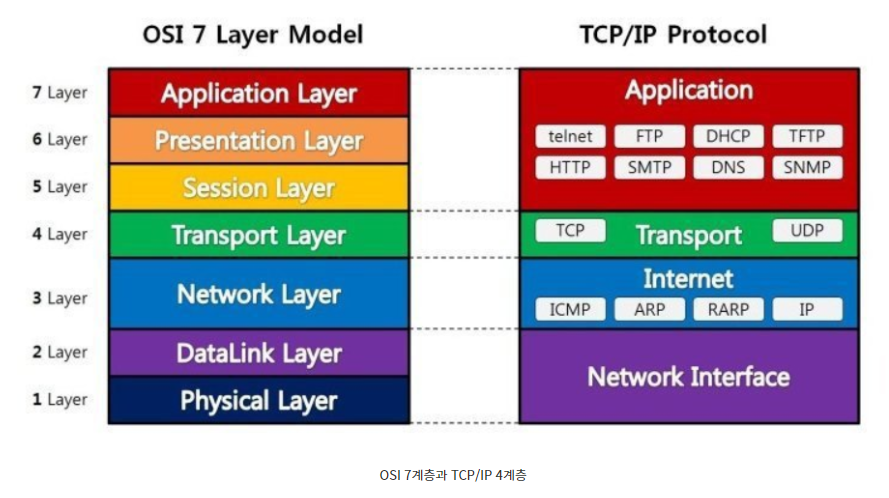
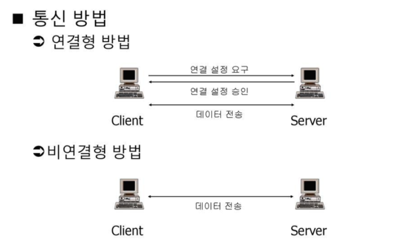

# Transport_Layer

## 목차

## TCP/IP 4Layer

TCP/IP 프로토콜은 4계층으로 구성되어 있다.

## 인터넷 계층의 역할
전송계층의 아래 단계인 인터넷 계층은 **패킷 전송**이라는 역할을 한다.

수신지까지 최적의 경로를 찾아 패킷을 전송할 뿐 패킷의 전송 순서나 완전성을 보장하지는 않는다.

## 전송계층의 역할
**전송 계층은 목적지에 신뢰할 수 있는 데이터를 전달한다.**

- 전송 계층에는 `오류를 점검`하는 기능이 있다. 오류가 발생하면 데이터를 재전송하도록 요청한다.
- 전송 계층에는 `전송된 데이터의 목적지가 어떤 어플리케이션인지 식별하는 기능`도 있다.

## 연결형 통신과 비연결형 통신
전송 계층의 특징은 `신뢰성/정확성`, `효율성`으로 구별할 수 있다.

- `신뢰성/정확성` : 데이터를 목적지에 문제없이 전달하는 것
- `효율성` : 데이터를 빠르고 효율적으로 전달하는 것

신뢰할 수 있고 정확한 데이터 -> 연결형 통신(TCP) 
호율적으로 데이터를 전달하는 통신 -> 비연결형 통신(UDP)

## 다중화와 역다중화
프로세스는 **소켓**을 가지고 있다.

**소켓을 통해서 프로세스와 프로세스가 네트워크를 통해 데이터를 주고 받을 수 있다.**

트랜트포트 계층은 메시지를 소켓에게 전달하여 전송한다.

이때 소켓은 **유일한 식별자**를 가지는데 해당 식별자는 TCP 소켓인지, UDP 소켓인지를 구별한다.

> 역다중화 
> 하위 레이어로부터 수신된 패킷을 올바른 Socket으로 전송하여 올바른 어플리케이션에게 전송하는 것. 
> 이때 정확한 어플리케이션의 Socket으로 전달해주기 위해 포트넘버를 활용한다.

> 다중화 
> 소켓들로부터 데이터를 모으고, 데이터는 세그먼트로 캡슐화되고 각 세그먼트를 네트워크 계층으로 전달하는 작업을 **다중화**하고 한다. 

### 트랜트포트 계층 다중화의 두가지 요구사항
1. 소켓은 유일한 식별자를 가진다.
2. 각 세그먼트는 세그먼트가 전달 될 적절한 소켓을 가리키는 특별한 필드를 가진다. 
=> 특별한 필드 : 출발지 포트 번호 필드, 목적지 포트 번호 필드

### 트랜트포트의 역다중화 동작과정
1. 호스트의 각 소켓을 포트 번호를 할당 받는다.
2. 세그먼트가 호스트에 도착하면 트랜스포트 계층은 세그먼트 안의 목적지 포트번호를 검사하고 상응하는 소켓으로 세그먼트를 보낸다.
3. 세그먼트의 데이터는 소켓을 통해 해당되는 프로세스로 전달된다.

## UDP의 다중화 역다중화
> UDP 소켓 19000을 가진 호스트A의 프로세스가 호스트 B의 UDP 소켓 46000을 가진 프로세스에게 데이터를 전송하고 가정해보자

1. 호스트 A는 출발지 포트번호(19000), 목적지 포트번호(46000), 2개의 중요하지 않은 값을 포함한 **세그먼트 생성**
2. 만들어진 세그먼트는 네트워크 계층으로 전달
3. 네트워크 계층은 세그먼트를 IP 데이터그램으로 캡슐화하여 목적지 호스트로 전송
4. 목적지 호스트에서 목적지 포트번호를 검사하고 역다중화

여기서 중요한 것은 UDP에서는 출발지에 IP주소와 포트번호를 사용하지 않았다. 즉 출발지의 IP주소와 포트번호는 무엇이든 46000포트로 도착하는 것이다. 
이것이 UDP의 단방향 통신이다.

## TCP의 다중화 역다중화
> TCP 소켓 19000을 가진 호스트A의 프로세스와 TCP 소켓 19000을 가진 호스트B가 동시에 웹서버 C로 데이터를 전송한다고 가정해보자

1. 호스트는 A는 출발지 포트번호(19000), IP주소(12.1.1.1), 목적지 포트번호(80), 목적지 IP주소(10.1.1.1)인 세그먼트 생성
2. 호스트는 B는 출발지 포트번호(19000), IP주소(191.1.2.12), 목적지 포트번호(80), 목적지 IP주소(10.1.1.1)인 세그먼트 생성
3. 만들어진 세그먼트는 네트워크 계층으로 전달
4. 네트워크 계층은 세그먼트는 IP데이터그램으로 캡슐화하여 목적지 주소로 전송
5. 출발지의 IP주소가 다르기 때문에 각각의 다른 포트로 역 다중화

> 궁금한것 : 애플리케이션은 TCP소켓과 UDP소켓을 다 가지고 있는 것인가 
> 역다중화는 웹서버가 받아서 웹서버의 독립된 소켓을 사용한다고 생각한다. 이전 스터디에서 소켓을 구별하는 방법은 `IP주소와 포트번호`가 아니라 `파일 디스크립터`라고 학습했다. 하지만 이번 교재에서는 다시 `IP주소와 포트번호`로 설명을 한다...

## 참고문헌
[연결형, 비연결형](https://github.com/wjdrbs96/Today-I-Learn/blob/master/Network/TransPort/1.%20%EC%A0%84%EC%86%A1%EA%B3%84%EC%B8%B5%EC%9D%98%20%EC%97%AD%ED%95%A0.md)

[요약](https://hyeo-noo.tistory.com/232?category=1022027#%C-%A-%--%ED%-A%B-%EB%-E%-C%EC%-A%A-%ED%-F%AC%ED%-A%B-%--%EA%B-%--%EC%B-%B-%--%EB%-B%A-%EC%A-%--%ED%--%--%EC%--%--%EB%-A%--%--%EB%--%--%--%EA%B-%--%EC%A-%--%--%EC%-A%--%EA%B-%AC%EC%--%AC%ED%--%AD%EC%-D%B-%--%EC%-E%--%EB%-B%A--)