# 트랜스포트 계층 개요

- [트랜스포트 계층 개요](#트랜스포트-계층-개요)
  - [네트워크 계층과 관계](#네트워크-계층과-관계)
  - [L4 프로토콜의 기능](#l4-프로토콜의-기능)
  - [역다중화의 요구 사항](#역다중화의-요구-사항)
  - [참고 문헌](#참고-문헌)

## 네트워크 계층과 관계

트랜스포트 계층 프로토콜은 
  
    서로 다른 호스트에서 동작하는 프로세스들 사이의 논리적 통신 제공한다.

네트워크 계층 프로토콜은

    호스트들 사이의 논리적 통신을 제공한다.

교재에 서술한 예시를 다이어그램으로 만들어보았다.

> 다만, 의문점은 L3 프로토콜이 마치 버퍼인냥 설명하였다.
> 
> L4 프로토콜의 세그먼트들이 하나의 패킷이 되지 않는다고 생각한다.

계층 간에는 계층 내부 동작에 신경쓰지 않는다.

예로, 트랜스포트 계층은 하위 네트워크 계층 프로토콜이 비신뢰적[^unbelievable]일때도,

[^unbelievable]: 패킷 분실 / 패킷 손상 / 패킷 복사본

애플리케이션 계층에게 신뢰적인 데이터 전송 서비스를 제공할 수 있다.

인터넷 네트워크 계층 프로토콜인 IP는

    best-effort delivery service로 
    
    트랜스포트 계층의 세그먼트를 전달하기 위해 노력하지만, 
    
    전달 / 순서 / 무결성을 보장 하지 않는다는 의미이다.    

## L4 프로토콜의 기능

트랜스포트 계층 프로토콜인 TCP와 UDP의 기본적인 기능은

    호스트-호스트의 IP 전달 서비스를 
    
    프로세스-프로세스의 전달 서비스로 확장하는 것이다.

    이를 역다중화와 다중화라 한다.

역다중화는

    트랜스포트 계층 세그먼트의 데이터를 
    
    올바른 프로세스의 소켓으로 전달하는 작업을 말한다.

다중화는

    프로세스의 소켓으로부터 데이터를 모으고, 
    
    세그먼트를 생성하기 위해 각 데이터에 헤더 정보로 캡슐화 한뒤

    그 세그먼트들을 네트워크 계층으로 전달하는 작업을 말한다.

> 역다중화와 다중화는 트랜스포트 계층 만의 기능이 아닌 
상위 계층을 둔 계층의 기본적인 기능이다.

## 역다중화의 요구 사항

적절한 프로세스로 전달하기 위한 소켓 식별을

UDP는 2가지

    수신측 포트 번호 / IP 주소

TCP는 4가지로 한다.

    송신측 / 수신측 포트 번호, 송신측 / 수신측 IP 주소

UDP가 송신측의 정보를 필요하지 않는 이유는

누구의 데이터인지를 확인하지 않기 때문이다.

그렇다면, 지난 주차에 다룬 

같은 포트 번호를 향해 2개의 송신측이 존재한다면

다른 소켓을 부여하는 TCP와 다르게 UDP는 어떻게 하는가?

본 교재 챕터 후반부에 연습문제에 대한 솔루션은 다음과 같이 말한다.

<dl><dt>
 the  operating  system  will  provide  the  process  with  the  IP addresses to determine the origins of the individual segments. 
</dt><dl>
 
도출할 수 있는 점은 UDP도 같은 포트 번호에 여러 개 소켓을 부여한다이다.

## 참고 문헌

[「본 교재 Ch03 과제와 질문」 솔루션](https://www.studocu.com/ko/document//세종대학교/데이터통신/컴퓨터네트워킹-하향식-접근-7판-솔루션/18143656) ━ *StuDocu*