# 트랜스포트 계층 개요

- [트랜스포트 계층 개요](#트랜스포트-계층-개요)
  - [네트워크 계층과 관계](#네트워크-계층과-관계)
  - [L4 프로토콜의 기능](#l4-프로토콜의-기능)
  - [역다중화의 요구 사항](#역다중화의-요구-사항)
  - [참고 문헌](#참고-문헌)

## 네트워크 계층과 관계

계층 간의 내부 동작에 신경쓰지 않는다.

```
cf. 트랜스포트 계층은 네트워크 계층 프로토콜이 비신뢰적일때도, 애플리케이션 계층에게 신뢰적인 데이터 전송 서비스를 제공할 수 있다.

    ※ 비신뢰적인 프로토콜: 패킷 분실, 패킷 손상, 패킷 복사본이 발생
```

## L4 프로토콜의 기능

트랜스포트 계층은 OSI 7 Layer에서 4번째 계층을 담당한다 (L4).

L4 프로토콜에는 TCP와 UDP가 대표적이다. 

TCP와 UDP의 기본적인 기능은 호스트 간 IP 전달 서비스를 프로세스 간 전달 서비스로 확장하는 것(역다중화, 다중화)이다.

```
※ 역다중화: 한 곳의 네트워크 계층으로 온 트랜스포트 계층 세그먼트의 데이터를 
            올바른 소켓으로 전달하는 작업

※ 다중화:   소켓으로부터 데이터를 찾고, 
            세그먼트를 생성하기 위해 각 데이터에 헤더 정보로 캡슐화 한뒤,
            그 세그먼트들을 한 곳의 네트워크 계층으로 전달하는 작업을 말한다.
```

이때, 중점적 키워드는 **"한 곳으로 오고 간다"** 이다.

<div align="center"></div>

## 역다중화의 요구 사항

적절한 프로세스로 전달하기 위한 소켓 식별은 L4 프로토콜 마다 다르다.

```
UDP는 2가지로 식별한다.
- 수신측 포트 번호
- 수신측 IP 주소

TCP는 4가지로 식별한다.
- 송신측 포트 번호
- 수신측 포트 번호
- 송신측 IP 주소
- 수신측 IP 주소
```

UDP가 송신측의 정보를 필요하지 않는 이유는 누구의 데이터인지를 확인하지 않기 때문이다.

그렇다면, 지난 주차에 다룬 질문에 본 교재 챕터 연습문제에 대한 솔루션에서 다음과 같이 말한다.

```
Q.  같은 포트 번호를 향해 2개의 송신측이 존재한다면, 
    다른 소켓을 부여하는 TCP와 다르게 UDP는 어떻게 하는가?

A.  the  operating  system  will  provide  the  process  with  the  IP addresses to determine the origins of the individual segments.
    (운영 체제는 개별 세그먼트의 기원을 결정하기 위해 IP 주소와 함께 프로세스를 제공합니다.)
```

즉, UDP도 같은 포트 번호에 여러 개 소켓을 부여한다.

<hr/>

## 참고 문헌

[「본 교재 Ch03 과제와 질문」 솔루션](https://www.studocu.com/ko/document//세종대학교/데이터통신/컴퓨터네트워킹-하향식-접근-7판-솔루션/18143656) ━ *StuDocu*