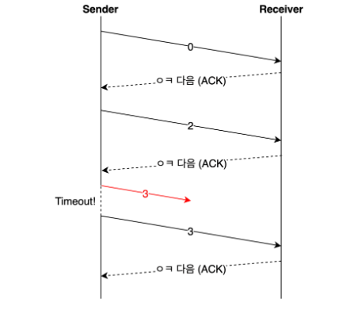

# TCP 흐름 제어 및 오류제어

> TCP 는 크게 3가지 제어 기능이 있다.
> - 전송되는 데이터의 양을 조정하는 **흐름 제어**
> - 데이터가 유실되거나 잘못된 데이터가 수신되었을 경우 대처하는 방법인 **오류 제어**
> - 네트워크 혼잡에 대처하는 **혼잡 제어**

## 흐름 제어
송신 측과 수신 측의 데이터 처리 속도가 다를 수 있다.

송신 측이 빠를 때 수신 측 버퍼가 넘치는 **오버플로우**가 발생한다.

이러한 문제를 줄이기 위해 윈도우 크기로 **송신 측 데이터 전송량을 조절**한다.
- 윈도우 크기 : 자신이 처리할 수 있는 데이터의 양

### 흐름 제어 방법

#### Stop and Wait
=> **매번 전송한 패킷에 대해 확인 응답을 받아야만 그 다음 패킷을 전송하는 방법**

해당 방법은 단순하지만 비효율적이라 사용 안함

#### Sliding Window
해당 방법을 대부분 사용

=> **송신 측이 수신 측에서 받은 윈도우 크기를 참고해서 데이터의 흐름을 제어하는 방식**

- 수신 측이 한 번에 처리할 수 있는 데이터의 양(윈도우 크기)을 **3 way handshake**할 때 송신 측에 전달한다.
- 상대방에게 **응답을 받지 않아도 범위 내에서 데이터를 보낼 수 있다.**
- 패킷의 왕복 시간(RTT)이 크다면 **네트워크가 혼잡하다고 생각하여 윈도우 크기를 실제 버퍼 크기보다 작세 설정**한다.
- 통신 과정 중에도 네트워크 혼잡 등의 조건을 통해 **윈도우 크기는 유동적으로 설정된다.**

**세부 구조**
1. 송신 버퍼

- 200 이전의 바이트는 이미 전송되었고, 확인응답을 받은 상태
- 200 ~ 202 바이트는 전송되었으나 확인 응답을 받지 못한 상태
- 203 ~ 211 바이트는 아직 전송이 되지 않은 상태

2. 수신 윈도우

3. 송신 윈도우

- 수신 윈도우보다 작거나 같은 크기로 윈도우를 지정하게되면 흐름제어가 가능하다.

4. 송신 윈도우 이동

- Before : 203 ~ 204를 전송하면 수신측에서는 확인 응답 203을 보내고, 송신측은 이를 받아 after와 같이 수신 윈도우를 203 ~ 209 범위로 이동
- after :  205 ~ 209가 전송 가능한 상태

## 오류제어
TCP는 통신 중에 오류가 발생하면 해당 데이터를 **재전송**한다. 
즉, **재전송 기반 오류 제어ARQ(Automatic Repeat Request)**를 사용한다. 
재전송은 비효율적이므로 적을수록 좋다.

### 오류를 아는 방법
- 송신측이 ACK를 받지 못함
  - 송신 측이 보낸 SEQ가 유실되었거나, 수신측의 보낸 ACK이 유실된경우
- 중복된 ACK을 받는다.

- 수신측이 NACK(부정응답)을 보냄

### 오류 제어 방법

#### Stop and Wait
=> **ACK를 받고 나서 다음 데이터를 보내는 방식** 
일정 시간이 지나 timeout이 발생하면 이전 데이터를 재전송한다.

#### Go Back N
=> 연속으로 데이터를 보내다가 **오류가 발생한 지점부터 재전송하는 방식** 

아래처럼 4번 데이터에서 에러가 발생했다면 4번 이후의 데이터는 모두 삭제한다. 
**성공적으로 전송된 데이터까지 재전송하기 때문에 비효율적이다.**

#### Selective Repeat
=> **오류가 발생한 데이터만 재전송하는 방식**

**버퍼의 데이터가 순차적이지 않다는 단점이 있다.**

정렬의 과정이 필요하다.

Go Back N과 상황에 따라 더 좋은 방법을 선정해 사용

## 참고 문헌
[흐름 제어 상세 내용 참고문헌](https://github.com/gyoogle/tech-interview-for-developer/blob/master/Computer%20Science/Network/TCP%20(%ED%9D%90%EB%A6%84%EC%A0%9C%EC%96%B4%ED%98%BC%EC%9E%A1%EC%A0%9C%EC%96%B4).md#tcp-%ED%9D%90%EB%A6%84%EC%A0%9C%EC%96%B4%ED%98%BC%EC%9E%A1%EC%A0%9C%EC%96%B4)

[오류 제어 참고 문헌](https://benlee73.tistory.com/186)