# TCP 흐름제어 및 오류제어

- [TCP 흐름제어 및 오류제어](#tcp-흐름제어-및-오류제어)
  - [TCP 흐름 제어](#tcp-흐름-제어)
  - [신뢰성 있는 데이터 전송의 원리](#신뢰성-있는-데이터-전송의-원리)
    - [키워드와 사용 의의](#키워드와-사용-의의)
  - [TCP 구조](#tcp-구조)
    - [이전 논제](#이전-논제)
  - [파이프라인된 신뢰성 있는 데이터 전송](#파이프라인된-신뢰성-있는-데이터-전송)
    - [에러 정정 방식과 ARQ](#에러-정정-방식과-arq)
    - [파이프라인 오류 회복](#파이프라인-오류-회복)
    - [TCP의 오류제어는 GBN과 SR의 혼합](#tcp의-오류제어는-gbn과-sr의-혼합)
  - [참고 문헌](#참고-문헌)

## TCP 흐름 제어

슬라이딩 윈도우 방식을 사용한다.

수신자가 한번에 처리할 수 있는 데이터를 정해놓고

그때그때 수신자의 데이터 처리 상황을 송신자에게 알려줘서 데이터의 흐름을 제어하는 방식이다.

`Stop-and-Wait`과의 큰 차이는 

    송신측은 수신측이 처리할 수 있는 데이터의 양을 알고 있다는 점이다.

    때문에, 수신측이 처리가능이라는 대답을 일일히 해주지 않아도 
    
    데이터를 보내기 전에 이게 처리될 지 안될 지 어느 정도 예측이 가능하다.

송신측과 수신측은 각각 데이터를 담을 수 있는 버퍼를 가지고 있고, 별도로 윈도우를 가지고 있다.

송신측은 이 윈도우에 들어있는 데이터를 수신측의 ACK이 없어도 연속적으로 보낼 수 있다.

송신측의 윈도우는 동적으로 변경되어 유연한 흐름제어를 할 수 있다.

영향을 주는 요소는 

1. 수신측이 보내준 버퍼 크기

        접속 3-way-handshake 때 송신측과 수신측은 자신의 현재 버퍼 크기를 서로에게 알려주게 되고,

        송신측은 수신측이 보내준 버퍼 크기를 사용하여 자신의 윈도우 크기를 정하게 된다.

2. 패킷의 왕복 시간 (RTT)

        송신측이 수신측으로 부터 ACK을 받기 까지 시간을 재고, 이 값을 통해 현재 네트워크 상황을 유추한다.

        이때 이 값이 너무 크다면 RTT가 느려 네트워크 상태가 좋지 않다고 판단하여 윈도우 크기를 조금 줄인다.

## 신뢰성 있는 데이터 전송의 원리

신뢰성 있는 데이터 전송은

    전송된 데이터가 손상되거나 손실되지 않고, 전송된 순서대로 전달된다.

문제는 하위 계층이 신뢰적이냐 아니냐로 신뢰성 작업의 난이도가 달라진다.

다음은 하위계층에 따라 신뢰성을 유지하는 상황들이다.

<table>
  <tr>    
    <th></th>
    <th>무손실 동작</th>
    <th>패킷 손실</th>
    <th>ACK 손실</th>
    <th>조급한 타임아웃</th>
  </tr>
  <tr> 
    <td>예사시진</td>
    <td></td>
    <td></td>
    <td></td>
    <td></td>
  </tr>
  <tr>
    <td rowspan="5">키워드</td>    
    <td colspan="4" align="center">
      체크섬      
    </td>
    </td>    
  </tr>
  <tr>
    <td align="center">-</td>
    <td colspan="3" align="center">
      긍정/부정 확인응답 
      타임아웃 및 재전송 
      순서번호
    </td>
  </tr>  
</table>

### 키워드와 사용 의의

**체크섬**

    전송된 패킷 안의 비트 오류를 발견하는데 사용된다.

> 🤔 간단히 설명

**긍정/부정 확인응답(ACK/NAK)**

    수신자에 의해 사용된다.    

    일반적으로 ACK/NAK은 사용되지 않고, 
    
    송신자에서 ACK이 오거나 오지 않으면 중복된 ACK으로 오류를 추정하는 방법을 사용한다.

    NAK을 사용하게되면 수신자가 상대방에게 ACK를 보낼 지 NAK을 보낼 지 선택해야하는 로직이 추가적으로 필요하기 때문이다.    

**타임아웃 및 재전송**

    패킷 손실을 회복하는 역할이다.

    주어진 타이머 동안 ACK/NAK을 받지 못하면 손실로 간주하여, 재전송한다.

    타임아웃 되는 상황은

      a. 패킷이 지연되었지만 손실되지는 않았을 때
      b. 수신자로부터 ACK이 손실되었을 때

    b의 상황에서는 송신자는 수신자로부터 중복된 확인응답을 받게된다.

    다만, 이를 순서번호로 재전송된 확인응답임을 알게된다. 

**순서번호**

    중복된 순서번호를 갖는 패킷은 수신자로 하여금 패킷 중복을 검출한다.

## TCP 구조

TCP는 데이터를 구조화되어 있지 않고,
단지 순서대로 정렬된 바이트 스트림[^byte-stream]으로 본다.

[^byte-stream]: 인코딩 되지 않은 바이트 그 자체(1byte 단위)를 전송하는 스트림

  

11주차에 등장한 내용을 다시 상기준 내용이다.

순서가 유지 되지 않는 상황은 TCP 구현 개발자에게 맡겨진다고 기술되있고,
어떤 구현이 있는지 `파이프라인 오류 회복`에서 다뤄봤다.

<dl><dt>
호스트 B가 자신의 세그먼트에 삽입하는 확인응답 번호는 
호스트 B가 호스트 A로부터 기대하는 다음 바이트의 순서번호이다.
</dt></dl>

  

### 이전 논제

이전 16주차 웹서버 주제때, 

접속 3-way-handshake 외에도 

데이터 송·수신에 3-way-handshake가 있을 수도 없을 수도 있다는 피드백을 들었다.

있는 사례는 교재 220p에 나온 Telnet이다.

Telnet은

    TCP 위에 동작하는 대화형 애플리케이션 프로토콜이다.

    송신자가 입력한 문자는 원격 호스트에 송신되어

    원격 호스트는 각 문자의 복사본을 송신자에게 반송하여 송신자는 화면에 표시되게 한다.

없는 사례는 대화형 애플리케이션이 아닌 경우라고 생각한다. 

    cf. HTTP

또한, [데이터 송·수신에 3-way-handshake가 있을 경우에 놓친 부분](https://slides.com/kimyongki/week-11-connect/embed)은 

마지막 way에서 사용하는 패킷의 순서번호를 생략한 점이다.

<dl><dt>
세그먼트가 데이터를 포함하지 않는데도,
TCP 순서번호 필드를 갖고 있으므로 세그먼트 역시 어떤 순서번호를 가져야한다.
</dt></dl>

교재는 

    이전 way에서 사용된 패킷의 확인응답 번호를 
    
    이번 way에서 사용할 패킷의 순서번호로 사용하고 있다.

## 파이프라인된 신뢰성 있는 데이터 전송

`Stop-and-Wait` 기법의 채널 이용률 문제를 해결한다.

### 에러 정정 방식과 ARQ

에러 정정 방식에는 2가지 종류가 있다.

- FEC(Foward Error Control) 방식
  
        송신자에서 송신을 할 경우,
        수신자에서 패킷을 알아서 검사하여 수정하는 방식이다.

        cf. CRC

- BEC(Backward Error Control) 방식

        송신자에서 송신을 하고 수신자에서 수신을 했을 때
        오류가 있으면 송신자에게 패킷을 재전송하라고 응답하는 방식이다.
        
    이 과정에서 수신자가 오류에 대해 자동으로 재전송을 요구하는 방식을 `ARQ(Automatic Repeat Request)`라고 한다.

        cf. GBN, SR
        
### 파이프라인 오류 회복

`Go-Back-n` 프로토콜은

    송신자가 손상되거나 손실된 패킷부터 전송한 지점까지 순서대로 다시 재전송하는 기법이다.        

    장점:  수신자 버퍼링이 간단하다.

           수신자가 상위 계층으로 데이터를 전달하기 위해
           하나의 로직이 복수로 나눠진 패킷을 취합하기 쉽다. 

    단점:  재전송이 높아져 채널 이용률이 높아진다.

애플릿 시연 순서와 각 과정은 다음과 같다.

이에 앞서 타이머에 대해 설명하면

    a. 송신자가 패킷을 전송하는 순간마다 타이머가 리셋된다.
    b. p에 대한 ACK 패킷이 오면 타이머가 리셋된다.
    b. p에 대한 ACK 패킷이 오지 않으면 타임아웃된다.

순서번호 p를 가진 패킷이 오류 없고, 순서대로 수신된다면

      
      1. 수신자는 p에 대한 ACK 패킷을 응답하고,
      2. 상위 계층에 패킷의 데이터 부분을 전달한다.

순서번호 p를 가진 패킷이 오류 없되, 순서를 유지하지 않은채 수신된다면

      즉, p + 1이 p보다 먼저 도착한다면
      
      1. p + 1 이전에 최근 순서가 유지된 순서번호에 대한 ACK 패킷을 재응답한다.
      2. 수신자는 이후 송신자로부터 수신받은 p 패킷을 버린다.      
      3. 송신자는 p에 대한 타임아웃이 생긴다.
      4. 송신자는 중복된 ACK 패킷에 담긴 순서번호 이후의 패킷을 모두 재전송한다.

패킷이 전송 중에 손실된다면

      1. p1, p2, p3가 전송 중에 p2가 손실되었다.
      2. 수신자는 p1에 대한 ACK 패킷을 응답하고,
      3. p2가 오지않되 p3에 대한 응답으로 p1에 대한 중복된 ACK 패킷을 응답한다.
      4. 송신자는 p2에 대한 타임아웃이 생긴다.
      5. 송신자는 p2, p3를 동시에 재전송한다.

ACK 패킷이 손실된다면

      1. p1, p2, p3가 응답되는 중에 p2의 ACK 패킷이 손실되었다.
      2. 송신자가 p3의 ACK 패킷은 받았다면 수신자가 p2, p3를 오류 없이 받았음을 의미함으로 이후 송신자의 액션은 없다.
      3. 만약, 송신자가 p2의 ACK 패킷도 받지 못했다면
      4. p2에 대한 타임아웃이 생긴다.
      5. 송신자는 p2, p3를 동시에 재전송한다.

 

`Selective Repeat` 프로토콜은

    송신자가 손상되거나 손실된 패킷만 다시 재전송하는 기법이다.

    장점: 채널 이용률을 줄인다.

    단점: a. 패킷마다 타이머를 사용한다.
          b. 수신자에서 패킷을 취합하기 어렵다.

애플릿 시연 순서와 각 과정은 다음과 같다.

이에 앞서 타이머에 대해 설명하면

    a. 송신자에게는 패킷마다 타이머가 존재한다.
    b. p에 대한 ACK 패킷이 오면 타이머가 리셋된다.
    b. p에 대한 ACK 패킷이 오지 않으면 타임아웃된다.

`Go-Back-n`과 차이가 있는 경우만 기술하겠다. 

순서번호 p를 가진 패킷이 오류 없되, 순서를 유지하지 않은채 수신된다면

      즉, p + 1이 p보다 먼저 도착한다면
      
      1. 수신자는 순서와 무관하게 요청온 패킷에 대한 ACK 패킷을 응답한다.
      2. 수신자는 p가 도착할때까지 p + 1을 수신 버퍼에 저장한다.
      3. p가 도착하면 패킷을 순서대로 상위 계층에 데이터 부분을 전달한다.

패킷이 전송 중에 손실된다면

      1. p1, p2, p3가 전송 중에 p2가 손실되었다.
      2. 수신자는 p1, p3에 대한 ACK 패킷을 응답하고,
      3. p3를 수신 버퍼에 저장한다.
      4. 송신자는 p2에 대한 타임아웃이 생긴다.
      5. 송신자는 p2를 재전송한다.

ACK 패킷이 손실된다면

      1. p1, p2, p3가 응답되는 중에 p2의 ACK 패킷이 손실되었다.
      2. 송신자는 p2를 재전송한다.

### TCP의 오류제어는 GBN과 SR의 혼합

**GBN과 비슷한 점**

    중복 ACK 패킷을 사용한다.
    
    최근 순서가 유지된 순서번호에 대한 ACK 패킷을 재응답한다.

**SR과 비슷한 점**

    손상되거나 손실된 패킷만 다시 재전송하는 기법이다.

SR과 큰 차이는 보이지 않는다.

이 차이는 혼잡 제어에서 밝혀진다.

## 참고 문헌

[프로토콜 애플릿](https://www2.tkn.tu-berlin.de/teaching/rn/animations/gbn_sr/) ━ *Johannes Kessler*

[TCP is GBN or SR](https://blog.naver.com/PostView.naver?blogId=whdgml1996&logNo=222148180270&parentCategoryNo=&categoryNo=83&viewDate=&isShowPopularPosts=false&from=postView) ━ *PaperCraft*

[패킷의 흐름과 오류를 제어하는 TCP](https://evan-moon.github.io/2019/11/22/tcp-flow-control-error-control/#tcp의-흐름-제어) ━ *Evans Library*