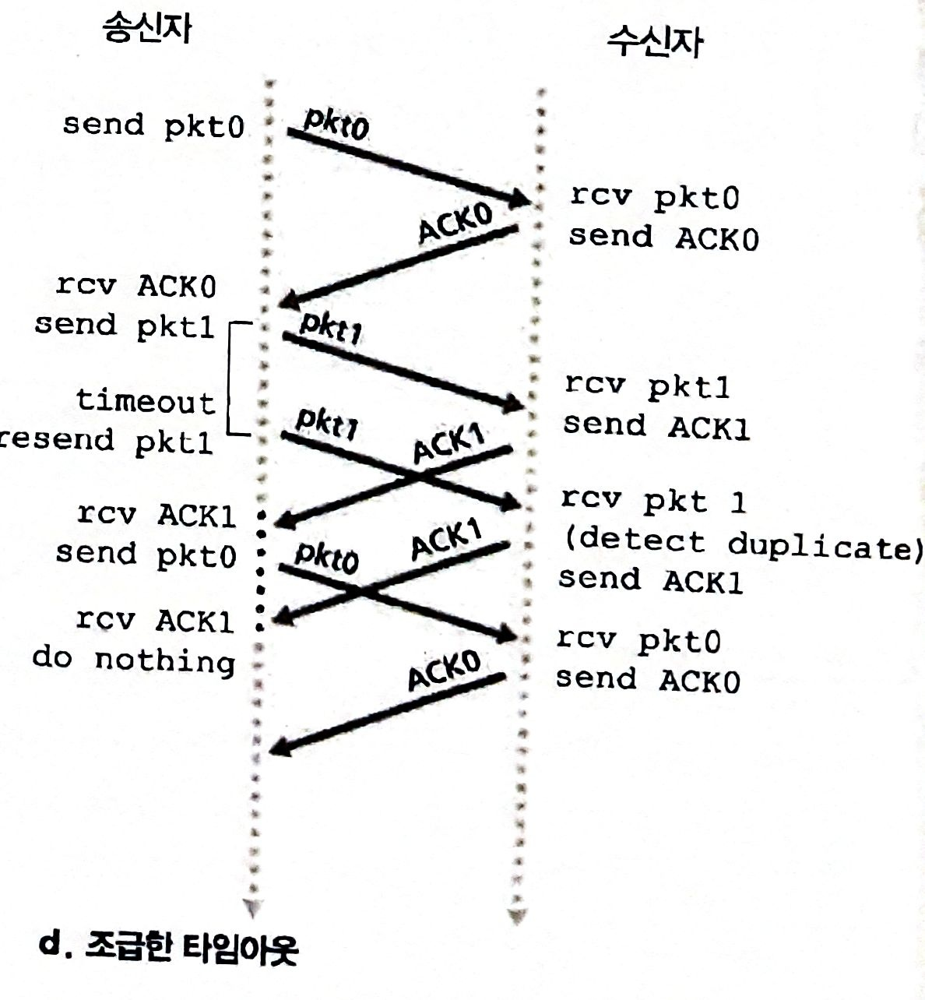

# 신뢰성 있는 데이터 전송 및 TCP

- [신뢰성 있는 데이터 전송 및 TCP](#신뢰성-있는-데이터-전송-및-tcp)
  - [신뢰성 있는 데이터 전송의 원리](#신뢰성-있는-데이터-전송의-원리)
    - [키워드와 사용 의의](#키워드와-사용-의의)
  - [TCP](#tcp)

## 신뢰성 있는 데이터 전송의 원리

신뢰성 있는 데이터 전송은

    전송된 데이터가 손상되거나 손실되지 않고, 전송된 순서대로 전달된다.

문제는 하위 계층이 신뢰적이냐 아니냐로 신뢰성 작업의 난이도가 달라진다.

다음은 하위계층에 따라 신뢰성을 유지하는 상황들이다.

<table>
  <tr>    
    <th></th>
    <th>무손실 동작</th>
    <th>패킷 손실</th>
    <th>ACK 손실</th>
    <th>조급한 타임아웃</th>
  </tr>
  <tr> 
    <td>예사시진</td>
    <td></td>
    <td></td>
    <td></td>
    <td></td>
  </tr>
  <tr>
    <td>키워드</td>
    <td align="center">-</td>
    <td>
      a. 체크섬         
      b. 긍정/부정 확인응답 
      c. 타임아웃과 재전송      
    </td>
    <td>순서번호</td>
    <td>파이프라이닝</td>
  </tr>
</table>

### 키워드와 사용 의의

**체크섬**

    패킷의 비트 오류 검출

**긍정/부정 확인응답**

    수신자 피드백

**타임아웃**

    패킷 손실에 대응한다.

    주어진 타이머 동안 ACK/NAK을 받지 못하면 손실로 간주한다.

    따라서, 패킷을 재전송한다.

**순서번호**

    중복 패킷 검출

## TCP