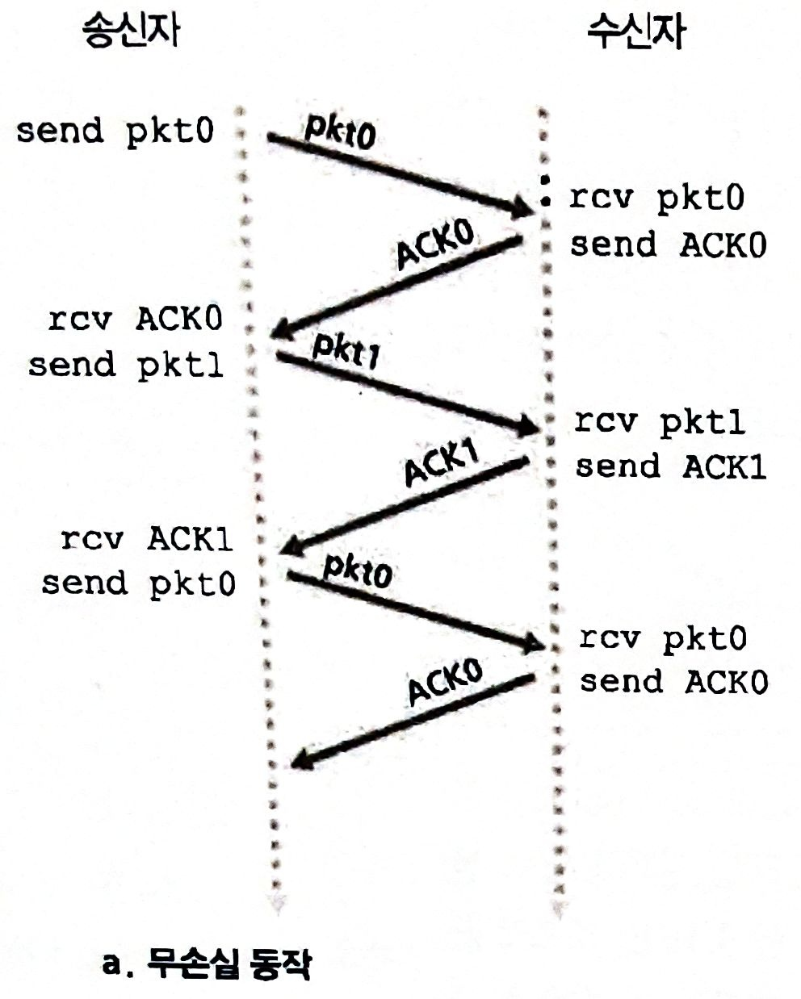
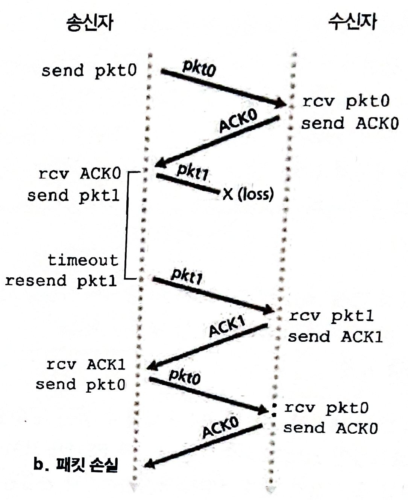

# 신뢰성 있는 데이터 전송 및 TCP

- [신뢰성 있는 데이터 전송 및 TCP](#신뢰성-있는-데이터-전송-및-tcp)
  - [신뢰성 있는 데이터 전송의 원리](#신뢰성-있는-데이터-전송의-원리)
    - [키워드와 사용 의의](#키워드와-사용-의의)
    - [파이프라인 오류 회복](#파이프라인-오류-회복)
  - [TCP](#tcp)
  - [참고 문헌](#참고-문헌)

## 신뢰성 있는 데이터 전송의 원리

신뢰성 있는 데이터 전송은

    전송된 데이터가 손상되거나 손실되지 않고, 전송된 순서대로 전달된다.

문제는 하위 계층이 신뢰적이냐 아니냐로 신뢰성 작업의 난이도가 달라진다.

다음은 하위계층에 따라 신뢰성을 유지하는 상황들이다.

<table>
  <tr>    
    <th></th>
    <th>무손실 동작</th>
    <th>패킷 손실</th>
    <th>ACK 손실</th>
    <th>조급한 타임아웃</th>
  </tr>
  <tr> 
    <td>예사시진</td>
    <td></td>
    <td></td>
    <td></td>
    <td></td>
  </tr>
  <tr>
    <td rowspan="5">키워드</td>    
    <td colspan="4" align="center">
      체크섬      
    </td>
    </td>    
  </tr>
  <tr>
    <td align="center">-</td>
    <td colspan="3" align="center">
      긍정/부정 확인응답 
      타임아웃 및 재전송 
      순서번호
    </td>
  </tr>
  <tr>    
    <td colspan="3" align="center">-</td>
    <td>파이프라이닝</td>
  </tr>
</table>

### 키워드와 사용 의의

**체크섬**

    전송된 패킷 안의 비트 오류를 발견하는데 사용된다.

> 🤔 간단히 설명

**긍정/부정 확인응답(ACK/NAK)**

    수신자에 의해 사용된다.
    
    패킷이 정확히 수신되었음/되지 않았다는 응답을 송신자에게 하기 위함이다.

    긍정 확인응답은 패킷의 순서번호 또는 확인응답된 패킷을 전달하며,

    부정 확인응답은 패킷의 순서번호만 전달한다.

**타임아웃 및 재전송**

    패킷 손실을 회복하는 역할이다.

    주어진 타이머 동안 ACK/NAK을 받지 못하면 손실로 간주하여, 재전송한다.

    타임아웃 되는 상황은

      a. 패킷이 지연되었지만 손실되지는 않았을 때
      b. 수신자로부터 ACK이 손실되었을 때      

**순서번호**

    중복된 순서번호를 갖는 패킷은 수신자로 하여금 패킷 중복을 검출한다.

**파이프라이닝**

    송신자는 주어진 범위에 있는 순서번호를 가진 패킷만 전송하도록 제한한다.
    
    이들은 확인응답이 아직 없지만, 다중 패킷을 전송할 수 있다.

> 16주차 HTTP 버전별 특징을 조사하면서 
> 파이프라이닝이 주어진 범위 내에서만 다중 패킷을 전송한다는 점은 알지 못했었다.

### 파이프라인 오류 회복

`Go-Back-n` 기법은 

    손상되거나 손실된 패킷을 해당 패킷 번호부터 순서대로 다시 재전송하는 기법이다.

    Stop-and-Wait 기법의 채널 이용률 문제를 해결한다.

`Selective Repeat` 기법은

    손상되거나 손실된 패킷의 패킷 번호만 다시 재전송하는 기법이다.

패킷의 순서는 바뀔 수 있다.

    패킷 p보다 p - 1이 먼저 도착했을시 
    
    p - 1은 버퍼에 저장한다는 말이며, 
    
    p도 도착함으로써 상위 계층에 보내지게 된다.

> 기법마다 애플릿 시연 순서는 다음과 같다.
> 1. 윈도우 만큼 전송 / 응답
> 2. 전송 손실
> 3. ACK 손실

## TCP

    ...

## 참고 문헌

[프로토콜 애플릿](https://www2.tkn.tu-berlin.de/teaching/rn/animations/gbn_sr/) ━ *Johannes Kessler*