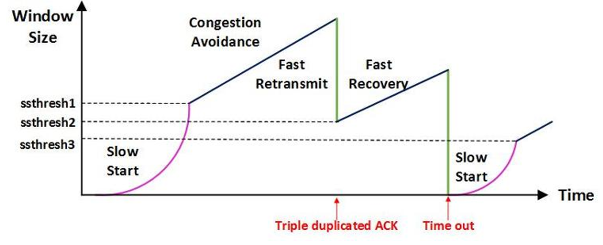
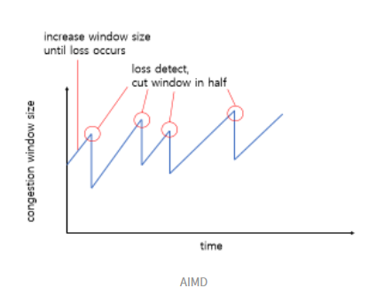
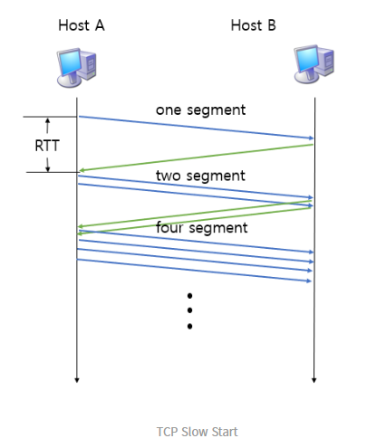
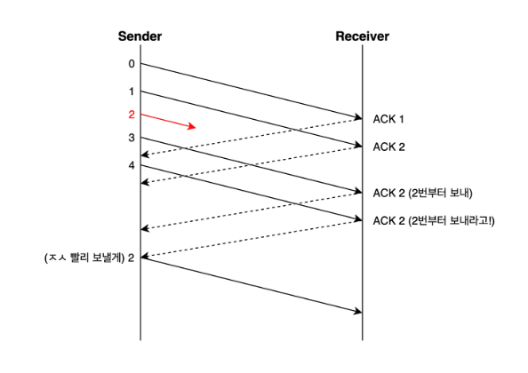
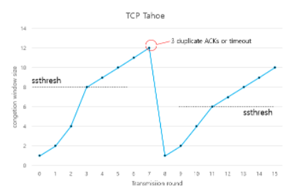
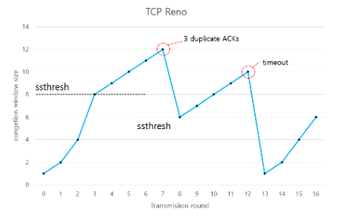

# TCP 혼잡제어

- 목차
  - 들어가며
  - 혼잡제어
  - 혼잡제어 방법
    - AIMD
    - Slow Start
  - 혼잡제어 정책
    - TCP Tahoe
    - TCP Reno
  - 참고문헌

## 들어가며
- TCP 통신이란?
  - 네트워크 통신에서 신뢰적인 연결방식
  - TCP는 기본적으로 unrelible network에서, reliable network를 보장할 수 있도록 하는 프로토콜
  - TCP는 network congestion avoidance algorithm을 사용

- **reliable network를 보장한다는 것은 4가지 문제점 존재**
  1. **손실** : packet이 손실될 수 있는 문제
  2. **순서 바뀜** : pactet의 순서가 바뀌는 문제
  3. **Congestion** : 네트워크가 혼잡한 문제
  4. **Overload** : receiver가 overload 되는 문제

> 전 주차에 TCP는 크게 3가지 제어 기능이 있다고 배웠다.
> - 전송되는 데이터의 양을 조정하는 **흐름 제어**
> - 데이터가 유실되거나 잘못된 데이터가 수신되었을 경우 대처하는 방법인 **오류 제어**
> - 송신측의 데이터 전달과 네트워크의 데이터 처리 속도 차이를 해결하기 위한 기법인 **혼잡 제어**

## 혼잡제어
=> 네트워크 내에 패킷의 수가 과도하게 증가하는 현상을 **혼잡**이라고 하며, 혼잡 현상을 방지하거나 제거하는 기능을 **혼잡제어**라고 한다.

- 송신 측의 데이터는 지역망이나 인터넷으로 연결된 대형 네트워크를 통해 전달된다. 만약 한 라우터에 데이터가 몰릴 경우, 자신에게 온 데이터를 모두 처리할 수 없게 된다. 이런 경우 호스트들은 또 다시 재전송을 하게되고 결국 혼잡만 가중시켜 오버플로우나 데이터 손실을 발생시키게 된다. 따라서 이러한 네트워크의 혼잡을 피하기 위해 송신측에서 보내는 데이터의 전송속도를 강제로 줄이는 기능이 있다. 이 기능을 **혼잡제어**라고한다.
- 흐름제어가 송신측과 수신측 사이의 전송속도를 다루는데 반해, 혼잡제어는 호스트와 라우터를 포함한 보다 넓은 관점에서 전송 문제를 다룬다.

## 혼잡 제어 방법

> 혼잡제어는 데이터의 전송속도를 조절하는 기능이다.
> 
> 윈도우 크기와 전송속도는 비례한다.

### AIMD(Additive Increase / Multiplicative Decrease)
- 송신 측의 windw size를 손실을 감지할 때까지 매 RTT마다 1MSS씩 증가
- 패킷 전송에 실패하거나 일정 시간을 넘으면 패킷을 보내는 속도를 절반으로 줄이는 방법
> 즉, 매 RTT를 기준으로
> 
> 정상 전송시 원도우 크기 + 1 MSS
> 
> 비정상 전송시 패킷 전송 속도 / 2 MSS

- 네트워크에 늦게 들어온 호스트가 처음에는 불리하지만, 시간이 흐르면서 평형상태로 수렴한다.
- 단점
  - 처음에 전송 속도를 올리는데 시간이 오래 걸린다.
  - 네트워크가 혼잡해지는 상황을 미리 감지하지 못한다. 즉, 네트워크가 혼잡해지고 나서야 대역폭을 줄인다.

#### Slow Start(느린 시작)
- 초기 window size : 1MSS
- 패킷이 문제 없이 도착하면 각각의 ACK패킷마다 window size를 1MSS씩 늘려준다.
  - 즉 매 RTT마다 window size는 2배가 됨
- 혼잡이 감지되면 윈도우 크기를 1MSS로 초기화한다.

- **임계점(Treshold)** 
  - 임계점은 여기까지만 Slow Start를 사용하겠다는 의미이다.
  - slow start threshodl(ssthresh)라고도 한다.

## TCP 혼잡 제어 정책
정책을 알아보기 전에 혼잡 상황을 알아보자

- 3 ACK Duplicated
  - 송신 측이 3번 이상 중복된 승인 번호를 받은 상황(패킷 손실)

- Timeout
  - 송신 측이 보낸 데이터 자체가 유실되었거나, 수신 측이 응답으로 보낸 ACK이 유실되는 경우

### TCP Tahoe

TCP Tahoe는 처음에는 Slow Start를 사용하다가 임계점에 도달하면 AIMD방식을 사용한다.

- 처음 Window size는 1 MSS이다.
- 임계점까지는 Slow Start를 사용한다.(window size가 2배씩 증가)
- 임계점 부터는 AIMD방식을 사용한다.(window size가 1씩 증가)
- 3 ACK Duplicate 또는 Timeout을 만나면 임계점을 window size의 절반으로 줄이고 window size를 1로 줄인다.

- **단점**
  - 3 ACK Duplicate방식을 만나고 window size가 다시 1부터 키워나가야 하므로 속도가 느리다.
  - 이를 해결하기 위해 TCP Reno가 등장한다.

### TCP Reno

TCP Reno는 TCP Tahoe와 비슷하지만 3 ACK Duplicate와 timeout 대처하는 방법이 다른다.

이유는 3 ACK Duplicate와 timeout을 비교했을 때 3ACK Duplicate는 timeout에 비해 큰 혼잡이 아니라는 가정하에 가볍게 대처하는 방식이다.

- timeout : 시간내에 패킷응답이 아예 오지 않는 것
- 3 ACK duplicate : timeout이 발생하기 이전에 중복 ACK이 3개 온다는 의미로 패킷의 전송은 잘 이루어 지고 있다는 의미

**동작 방식**
- 처음 Window size는 1 MSS이다.
- 임계점까지는 Slow Start를 사용한다.(window size가 2배씩 증가)
- 임계점 부터는 AIMD방식을 사용한다.(window size가 1씩 증가)
- 3 ACK Duplicate를 만나면 window size를 절반으로 줄이고 임계점을 그 값을 설정한다.
- Timeout을 만나면 window size를 일로 줄인다. 임계점은 변경 x

## 참고 문헌
[참고문헌](https://evan-moon.github.io/2019/11/26/tcp-congestion-control/)

[참고문헌](https://code-lab1.tistory.com/30)

