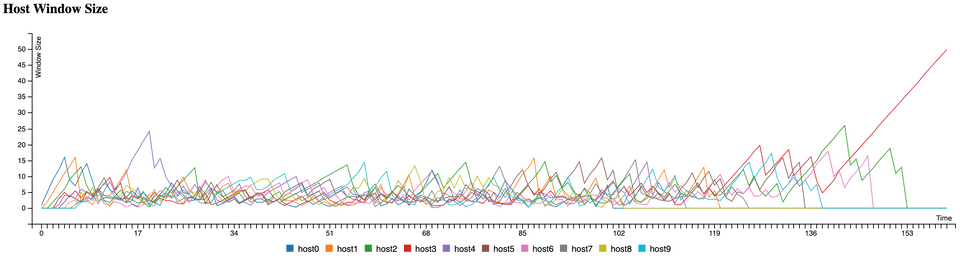
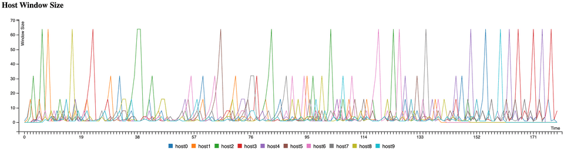
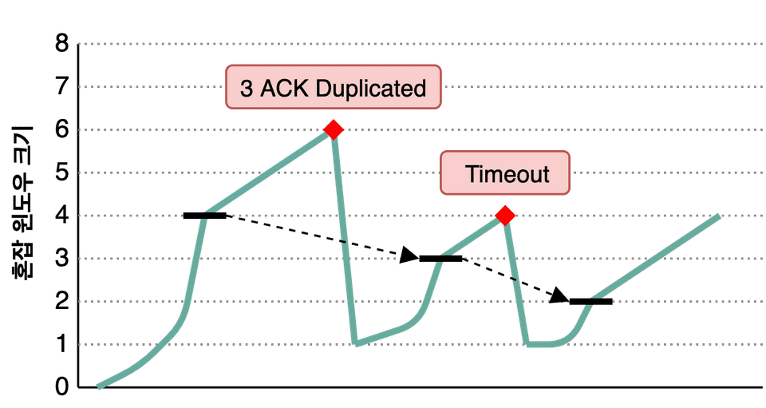
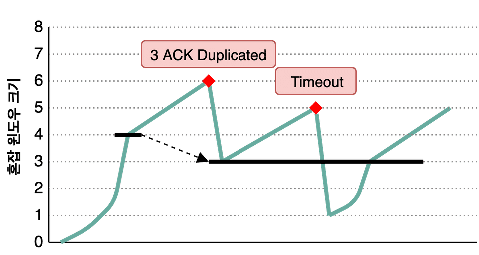

# TCP 혼잡 제어

- [TCP 혼잡 제어](#tcp-혼잡-제어)
  - [들어가며](#들어가며)
  - [혼잡 회피 기법](#혼잡-회피-기법)
    - [AIMD (Additive Increase / Multicative Decrease)](#aimd-additive-increase--multicative-decrease)
    - [Slow Start](#slow-start)
  - [혼잡 제어 정책](#혼잡-제어-정책)
    - [TCP Tahoe](#tcp-tahoe)
    - [TCP Reno](#tcp-reno)
    - [TCP Cubic](#tcp-cubic)
  - [참고 문헌](#참고-문헌)

## 들어가며

네트워크 혼잡 원인은

    오류 제어 기법인 송신측의 재전송이다.

TCP는 종단 간의 혼잡 제어를 사용하는데,

    네트워크의 혼잡 상태를 파악하고 그 상태를 해결하기 위해 송신측의 윈도우 크기를 조절하여 데이터 전송을 제어하는 것이다.

> 네트워크 지원 혼잡제어는 비신뢰적인 IP가 종단 시스템에 어떠한 피드백도 주지 않는다.

송신측의 윈도우는 이전 주차에서 기술한대로

    수신측이 보내준 윈도우 크기인 RWND와

    네트워크 상황을 고려해서 정한 윈도우 크기인 CWND 중 
    
    더 작은 값을 사용한다.

송신측은 혼잡 상황에 대한 감지를

    혼잡이 발생하면 경로에 있는 하나 이상의 라우터 버퍼들이 오버플로 되고, 그 결과 패킷이 손실된다.

    송신측은 타임아웃 또는 3개의 중복된 ACK으로 감지한다.

3개의 중복된 ACK을 감지하는 이유는

    수신측이 패킷을 순서대로 받는 보장이 없기 때문에

    한 두개의 중복된 순서번호로 네트워크를 혼잡하다고 판단하지 않는다.

## 혼잡 회피 기법

혼잡 제어는 이 회피 기법을 적절히 사용한다.

### AIMD (Additive Increase / Multicative Decrease)

    네트워크에 혼잡이 없어 전송 속도를 더 빠르게 하고 싶다면 
    
    매 RTT마다 윈도우를 1씩 선형적으로 증가시키고,

    혼잡 상태를 감지하면 윈도우를 반으로 줄인다.

AIMD는 공평하다.

    네트워크를 점유하는 호스트 A보다 뒤늦게 합류한 호스트 B는 윈도우가 작아 불리하다.

    네트워크가 혼잡해지면 호스트 A는 윈도우를 반으로 줄일 것이며

    남은 대역폭을 호스트 B가 활용하여 윈도우를 키울 수 있다.

단점은

    대역폭이 많이 남아도 윈도우를 너무 조금씩 늘린다는 것이다.

    즉, 모든 대역을 제대로 된 속도로 통신하기까지 오래걸린다.

### Slow Start

    RTT마다 윈도우를 증가시킬 때 지수적으로 증가시키다가 

    네트워크가 혼잡해지면 윈도우를 1로 줄여버린다.

Slow Start에는 임계점이 있는데, 지수적으로 증가되는 윈도우 크기를 제어하기 위해서이다.

시간이 갈수록 윈도우 크기는 빠르게 증가된다.

## 혼잡 제어 정책

### TCP Tahoe

송신측은 임계점을 만나기 전까지 Slow Start 기법을 사용하다가

임계점을 넘어선 이후부터는 AIMD 기법을 사용한다.

만약 혼잡 상황이 발생한다면, 다음과 같이 상태값을 변경한다.

    윈도우            = 1

    Slow Start 임계치 = 혼잡이 검출된 시점의 윈도우 / 2

단점은

    혼잡 상황 이후에 윈도우를 1부터 키워나간다는 점이다.

### TCP Reno

Reno는 혼잡 상황인 3개의 중복된 ACK과 타임아웃을 구분한다는 점이다.

3개의 중복된 ACK이 발생하면, 다음과 같이 상태값을 변경한다.

    윈도우            = 혼잡이 검출된 시점의 윈도우 / 2

    Slow Start 임계치 = 혼잡이 검출된 시점의 윈도우 / 2

이는 대역폭에 맞는 적정 수준의 윈도우 크기로 되돌아옴이 Tahoe 보다 빠르다.

타임아웃이 발생하면, Tahoe와 동일하다.

    윈도우            = 1

    Slow Start 임계치 = 혼잡이 검출된 시점의 윈도우 / 2

### TCP Cubic

    ...

## 참고 문헌

[사이 좋게 네트워크를 나눠 쓰는 방법, TCP의 혼잡 제어](https://evan-moon.github.io/2019/11/26/tcp-congestion-control/) ━ *Evans Library*