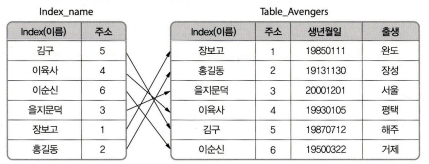
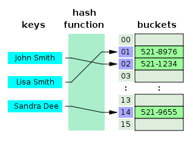
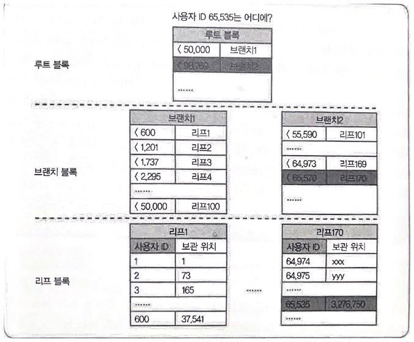

# 데이터베이스 인덱스

## 목차
- 인덱스란
- 인덱스 관리
- 인덱스 장단점
- 인덱스 자료구조
  - 해시 테이블
  - B+Tree
- RDBMS에서 최적화 방법
  - 고유성 보장
  - 멀티컬럼 인덱스
  - 인덱스만 검색
  - 인덱스 병합
- 업데이트 비용을 절감 방법
  - 모아서 디스크에 기록
  - 병렬 갱신 성능 높이기
- 참고문헌

## 인덱스란?
- 인덱스
  - 인덱스는 데이터를 빠르게 찾을 수 있는 수단으로서, 테이블에 대한 조회 속도를 높여주는 자료 구조이다.
  - 인덱스는 테이블의 특정 레코드 위치를 알려주는 용도로 사용한다.
  - 일상생활에서의 인덱스 => `책의 색인`

## 인덱스 관리
DBMS는 인덱스를 항상 최신의 정렬된 상태로 유지해야 원하는 값을 빠르게 탐색가능하다.

그렇기 때문에 인덱스를 통해 INSERT / UPDATE / DELETE가 수행된다면 각각 연산을 추가적으로 해야하기 때문에 그에 따른 오버헤드가 발생한다.

**[ DML ]**

Data Manipulation Language는 데이터베이스에 저장된 자료들을 입력, 수정, 삭제, 조회하는 언어이다.

**[ DML 명령어 ]**

- SELECT : 인덱스에 저장된 정보를 조회함
- INSERT : 새로운 데이터에 대한 인덱스를 추가함
- DELETE : 삭제하는 데이터의 인덱스를 사용하지 않는다는 작업을 진행함
- UPDATE : 기존의 인덱스를 사용하지 않음 처리하고, 갱신된 데이터에 대해 인덱스를 추가함

## 인덱스의 장단점
- 장점
  - 테이블을 조회하는 속도와 그에 따른 성능을 향상시킬 수 있다.
  - 전반적인 시스템의 부하를 줄일 수 있다.
- 단점
  - 인덱스를 관리하기 위해 DB의 약 10%에 해당하는 저장공간이 필요하다.
  - 인덱스를 관리하기 위해 추가 작업이 필요하다.
  - 인덱스를 잘못 사용할 경우 오히려 성능이 저하되는 역효과가 발생할 수 있다.

## 인덱스의 자료구조

### 해시 테이블
`Key, Value`로 데이터를 저장하는 자료구조 중 하나로 **빠른 데이터 검색이 필요할 때 유용**하다. 해시 테이블은 Key값을 이용하여 고유한 index를 생성해 그 안에 Value를 저장한다.

[ 해시테이블의 장단점 ]

- 장점
  - 인덱스를 통한 조회의 시간복잡도가 O(1)
  - 해시 계산 비용이 데이터의 양에 의존하기 않기 때문에 데이터의 양이 늘어도 계산량은 변하지 않는다.
- 단점
  - 해시 충돌 판정 및 재계산이 있으므로 데이터의 양이 늘수록 평균 처리 속도가 증가한다.
  - 해시는 (=) 연산에서 매우 빠른 효율을 보여주지만, (>, <)연산에는 맞지 않다.
    - 예를 들면 가격이 10000원 이하인 선물을 찾는다.
    - 제목이 "Final"로 시작하는 게임 리스트를 찾는다.
    - 일기 포스팅 시간이 최신 순으로 정렬하고 싶다.

즉, 단일 값을 찾는 연산에서는 높은 속도를 자랑하지만 복수의 값을 찾아야하는 경우에 너무 나쁜 효율을 가지고 있기 때문에 잘 사용하지 않는다.

### B+Tree

B+Tree 인덱스는 Tree의 구조를 가진 인덱스이다.

- B+tree의 구조
  - 정상인 Root
  - 중간 다리역할의 Branch
  - 최하층 Leaf
- 이진 트리가 아닌 다분기 트리
  - Leaf의 갯수에 제한이 없다.
- Leaf노드만 인덱스와 함께 데이터를 가지고 있고, 나머지 노드들은 데이터를 위한 인덱스만 갖는다.
- 인덱스를 통한 조회의 시간복잡도가 O(logmN) //m은 Leaf의 개수
- Leaf노드들은 LinkedList로 연결되어 있다.
  - 인접한 노드끼리 바로 접근 가능

> RDBMS에서 B+Tree가 표준이 되었다.

## RDBMS에서 최적화 방법

### 고유성 보장
텍스트 파일의 경우 중복 체크를 할려면 **전체 검색**을 해야한다.

인덱스를 사용하면 빠른 중복 체크 가능
- 해시 인덱시라면 동일한 ID인 경우 반드시 동일한 해시값이 나옴
- B+Tree라면 동일한 리프블록에 도달

### 멀티컬럼 인덱스
두 개 이상의 컬럼으로 하나의 인덱스를 만들면 AND 조건 검색을 빠르게 할 수 있다.

### 인덱스만 검색
데이터 검색시, 인덱스 검색 -> 데이터 검색을 해야한다. 
만약 데이터의 `갯수`검색시, 인덱스 검색만 해 속도 향상

### 인덱스 병합
두 개 이상의 컬럼를 동시에 한 번의 검색 추출하고 조건 연산을 통해 인덱스를 병합해 인덱스를 찾으므로 효율적 동작 가능

## 업데이트 비용을 절감 방법

### 모아서 디스크에 기록
- MySQL에서 사용되는 방식
- 업데이트된 정보를 메모리나 전용 파일에 임시로 저장했다가 모아서 한번에 리프 블록을 갱신하는 구조이다.
- 갱신할 때 Ramdom write가 아닌 sequential write로 작성해 처리 속도가 빠르다.

### 병렬 갱신 성능 높이기
갱신시 Data의 수정이 필요하다. 이를 `리프 분할`이라고한다.

MySQL는 리프 분할시, 데이터 일관성을 위해 인덱스의 재편성이 끝나기 전까지 참조/갱신을 차단한다.

이는 동시성이 높지 않다.

그래서 MySQL는 이런 경우에 `파티션 테이블`을 사용한다. 논리적으로는 하나의 테이블이 물리적으로 두 개의 테이블로 관리되고 있기 때문에 인덱스 업데이트의 동시성을 늘릴 수 있다.

## 참고문헌
[책 요약](https://showerbugs.github.io/books/database/%EB%8D%B0%EC%9D%B4%ED%84%B0%EB%B2%A0%EC%9D%B4%EC%8A%A4%EB%A5%BC%20%EC%A7%80%ED%83%B1%ED%95%98%EB%8A%94%20%EA%B8%B0%EC%88%A0%20%EC%B1%95%ED%84%B0%201,%202)

[데이터베이스 인덱스](https://mangkyu.tistory.com/96)

