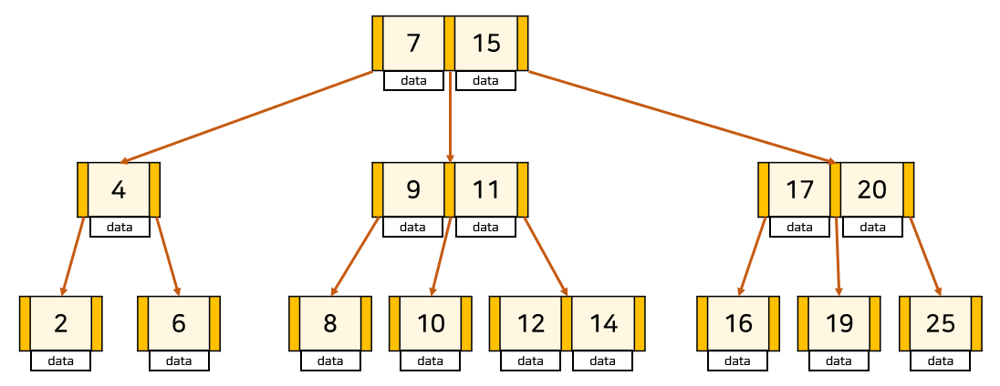
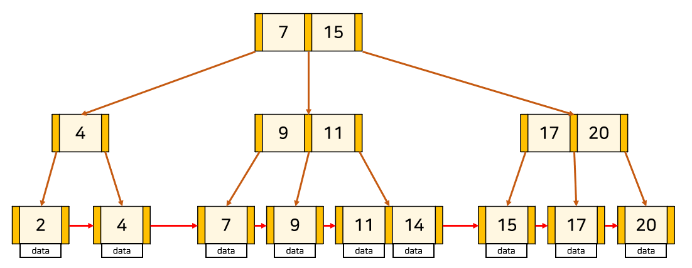

# 데이터베이스 필요성과 인덱스

- [데이터베이스 필요성과 인덱스](#데이터베이스-필요성과-인덱스)
  - [데이터베이스의 필요성](#데이터베이스의-필요성)
  - [인덱스에 적합한 자료구조](#인덱스에-적합한-자료구조)
    - [B tree](#b-tree)
  - [잘못된 인덱스 사용 사례](#잘못된-인덱스-사용-사례)
  - [참고 문헌](#참고-문헌)

## 데이터베이스의 필요성

교재에 다음과 같은 질문이 있었다.

<dl><dt>
Excel로는 왜 충분하지 않지?
</dt></dl>

이 질문을 보고 *생활코딩*에서 스크랩한 토론글이 떠올라서 정리해본다.

토론글의 필자는 엑셀을 10년 넘게 쓴 사람으로 엑셀을 다음과 같은 장/단점을 달고 사용하다가 

    장점:  직관적인 인터페이스
    단점:  큰 용량에 대해 느린 데이터 수정 연산

최근 데이터베이스를 공부하게 됬는데 데이터베이스 중요성에 대해 자세한 설명을 찾지 못해서 올린 글이었다.

따라서, 답변을 단 사람들의 글을 정리해보게 되었다.

    A1. 배포의 용이성
      
      엑셀: 수정시에 수정본을 여러명에게 배포해야한다.
            원본, 사본 이원화로 구분의 문제가 생긴다.

      DB:   수정시에 누구나 최신버전을 가지고 있을 수 있다.

    A2. 중앙집중 데이터 처리        

      엑셀: 파일 단위로 누군가 파일을 열어서 작업하면
            다른 사람은 읽기전용으로만 접근

      DB:   서버 개념으로 여러명이 동시에 서버에 붙어서 데이터 작업 처리가 가능하다.
            ※ 병렬성 제어로 개념이 이어진다고 본다.

이 외에 교재에 적힌 필요성은 다음과 같다. 

- 대량의 데이터 중에서 필요한 것을 빨리 반환
  
  > 인덱스를 통해 빠른 탐색이 가능하며, 다음 목차에서 기술한다.

- 장애가 발생했을 때 빠른 복구로 데이터 무결성 보장

> 필요성에 대한 이해는 앞으로 진행될 주차에 기술될거라 판단한다

## 인덱스에 적합한 자료구조

인덱스는

    인덱스를 관리하기 위한 저장 성능을 희생해서 (DB의 10%의 공간)

    탐색에 대한 성능을 대폭 상승하는 방식이다.

형태는

    키-필드만 가지고, 테이블의 세부 항목을 가지고 있지 않는다.

    +------------------+---------------------------+        +---------+---------+---------+---------+
    | index(책의 목차) | pointer(책의 페이지 번호)  |        | pointer | 데이터A | 데이터B | 데이터C |
    +------------------+---------------------------+    →   +---------+---------+---------+---------+
    |        10        |            _300           |        |   _300  |    -    |    -    |    -    |
    +------------------+---------------------------+        +---------+---------+---------+---------+

핵심은

    여러 데이터를 탐색하기 위해 부등호를 사용할 수 있고, 때문에 정렬을 요구한다.

사용하기 좋은 경우는

    a. 규모가 큰 테이블

    b. 삽입/수정/삭제 작업이 자주 발생하지 않는 컬럼

        인덱스는 삭제시 '사용하지 않음' 상태로 남겨두기 때문에 수정 작업이 많으면 별도의 메모리 공간에 저장된다.

        > 🤔 왜 사용하지 않음으로 두는가

    c. 중복도가 낮은 컬럼        

|                            |           배열           |                              해시테이블                              | 레드-블랙 tree[^RedBlack-tree] |        B tree         |
| :------------------------: | :----------------------: | :------------------------------------------------------------------: | :----------------------------: | :-------------------: |
|         탐색 시간          |          `O(n)`          |                                `O(1)`                                |         `O(log n)`          |    `O(log n)`     |
|      참조 포인터 연산      |           없다           |                                 많다                                 |              많다              | 적다[^less-reference] |
| 부등호 연산<br>(정렬 여부) |            O             |                                  X                                   |               O                |           O           |
|         그외 장점          |            -             | 고정된 키 값에 <br>다양한 데이터 타입 사용 가능[^multiple-data-type] |               -                |           -           |
|            단점            | 삽입/삭제 시간<br>`O(n)` |                    하나의 데이터만 <br>빠른 탐색                     |    노드당 참조 포인터 사용     |           -           |

[^multiple-data-type]: 숫자, 문자열, 날짜/시간 중 긴 것에 맞추지 않고, 해시 함수에 대입하여 고정된 키 값을 유지할 수 있다.

[^RedBlack-tree]: 정렬이 유지된 트리이다.
    
[^less-reference]: 노드 하나에 고정된 배열이 있어 여러 데이터가 저장될 수 있다.
    
    노드를 참조 포인터로 탐색한 이후에 

    노드 배열은 실제 메모리의 순서를 반영함으로 참조 포인터 접근의 수를 줄인다.

### B tree

<table>
    <tr>
        <th colspan="2"><code>B-tree</code></th>
    </tr>
    <tr>
        <td>
            
        </td>
        <td>
<p>

장점은

    평균적으로 leaf 노드까지 가지 않는다.

단점은

    모든 데이터를 탐색하는 데(Full scan)에는 
    모든 노드를 방문해야해서 비효율적이다.
</p>
        </td>
    </tr>
</table>

가장 범용적으로 사용되는

<table>
    <tr>
        <th colspan="2"><code>B+tree</code></th>
    </tr>
    <tr>
        <td colspan="2">
<p>

    오직 leaf 노드에만 데이터를 저장하고, root, bracnh 노드에는 자식 포인터(key)만 저장한다.

    또한, leaf 노드 끼리는 연결 리스트로 연결된다.
</p>
        </td>
    </tr>
    <tr>
        <td>
            
        </td>
        <td>
<p>

장점은

    - leaf 노드를 제외한 노드는 
    
      데이터를 저장하지 않아 메모리를 아끼며,
      그 공간에 더 많은 key를 가질 수 있다.

      이는, 트리의 높이를 낮추므로 탐색 속도를 높인다.

    - Full scan에 연결 리스트 갯수만큼만 선형 시간 소모하면된다.

단점은

     B-tree장점의 반대이다.

     하지만, 트리의 높이가 낮다면 큰 문제는 아니라 판단한다.
</p>
        </td>
    </tr>
</table>

## 잘못된 인덱스 사용 사례

고용자들에 대한 테이블에 성(last_name), 이름(first_name) 순서로 찾아오려고 한다. 

이 순서에 맞게 멀티 칼럼 인덱스를 설정하는 것이 적절하다.

```sql
CREATE INDEX ix_name on employees (last_name, first_name);

SELECT * FROM employees ORDER BY last_name, first_name LIMIT 300;
```

> 30만 컬럼을 보유한 테이블에서 이러한 순서의 차이로 실습을 해본 결과 
 잘못 사용할 시, 669ms의 성능에서
 적절히 사용할 시, 16ms의 성능 향상 효과를 보았다.

<hr/>

## 참고 문헌

[데이터베이스의 필요성 토론글](https://www.facebook.com/groups/codingeverybody/posts/6454403514600130/) ━ *생활코딩*

[데이터베이스 인덱스에 적합한 자료구조](https://helloinyong.tistory.com/296) ━ *Hello Inyong*

[B+tree](https://rebro.kr/167) ━ *Rebro의 코딩 일기장*

[잘못된 인덱스 사용 사례](http://www.yes24.com/Product/Goods/5269099) ━ *「SQL AntiPatterns: Ch13. 인덱스 샷건」*

[인덱스 실습 자료](https://github.com/wikibook/realmysql80) ━ *Github*