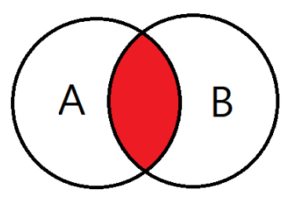
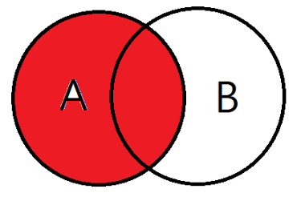
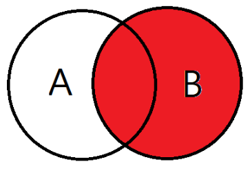
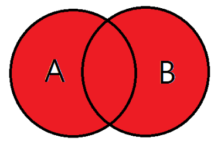
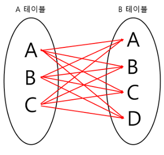
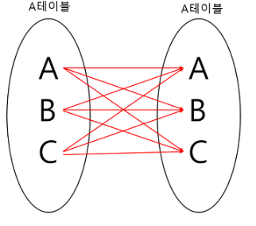
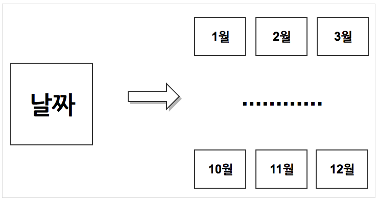
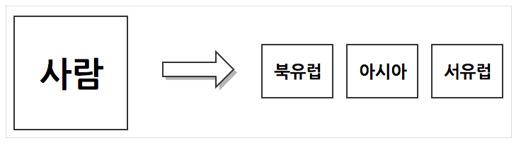

# SQL- [SQL](#sql)
  - [SQL이란?](#sql이란)
  - [SQL 구문](#sql-구문)
    - [데이터 정의 언어(DDL : Data Definition Language)](#데이터-정의-언어ddl--data-definition-language)
    - [데이터 조작 언어(DML : Data Mainpulation Language)](#데이터-조작-언어dml--data-mainpulation-language)
    - [데이터 제어 언어(DCL : Data Control Language)](#데이터-제어-언어dcl--data-control-language)
  - [테이블 작성하기](#테이블-작성하기)
    - [날짜 자료형](#날짜-자료형)
  - [JOIN](#join)
    - [JOIN 종류](#join-종류)
      - [조인을 사용할 경우 주의사항](#조인을-사용할-경우-주의사항)
      - [조인을 사용할 때 고려사항](#조인을-사용할-때-고려사항)
  - [Partitioning](#partitioning)
    - [Partitioning 등장배경](#partitioning-등장배경)
    - [Partitioning이란?](#partitioning이란)
    - [Partitioning 종류](#partitioning-종류)
  - [Sharding](#sharding)
    - [Sharding 등장배경](#sharding-등장배경)
    - [파티셔닝과 샤딩의 차이](#파티셔닝과-샤딩의-차이)
  - [SQL의 장단점](#sql의-장단점)
  - [참고문헌](#참고문헌)


## SQL이란?
> Structured Query Language, 구조화 질의어</br>
> RDBMS의 데이터를 관리하기 위해 설계된 특수 목적의 프로그래밍 언어이다.

## SQL 구문

### 데이터 정의 언어(DDL : Data Definition Language)

> 관계형 데이터베이스의 구조를 정의한다.</br>
> 논리적 데이터 구조와 물리적 데이터 구조의 사상을 정의한다.

| 명령어 | 기능 |
|---|---|
| CREATE | SCHEMA, DOMAIN, TABLE, VIEW, INDEX를 정의한다. |
| ALTER | TABLE에 대한 정의를 변경하는데 사용한다. |
| DROP | SCHEMA, DOMAIN, TABLE, VIEW, INDEX를 삭제한다. |

### 데이터 조작 언어(DML : Data Mainpulation Language)

> 데이터베이스 사용자가 응용 프로그램이나 질의어를 통하여 저장된 테이터를 실질적으로 처리하는데 사용되는 언어이다.</br>
> 데이터베이스 사용자와 데이터베이스 관리 시스템 간의 인터페이스를 제공한다.

| 명령어 | 기능 |
|---|---|
| SELECT | 테이블에서 조건에 맞는 튜플을 검색한다. |
| INSERT | 테이블에 새로운 튜플을 삽입한다. |
| DELETE | 테이블에서 조건에 맞는 튜플을 삭제한다. |
| UPDATE | 테이블에서 조건에 맞는 튜플의 내용을 변경한다. |

### 데이터 제어 언어(DCL : Data Control Language)

> 데이터베이스에서 데이터에 대한 **엑세스를 제어**(데이터의 보안, 무결성, 회복, 병행 수행)하기 위한 언어이다.</br>
> 데이터베이스 관리자가 데이터 관리를 목적으로 사용한다.

| 명령어 | 기능 |
|---|---|
| COMMIT | 명령에 의해 수행된 결과를 실제 물리적 디스크에 저장하고, 데이터베이스 조작 작업이 정상적으로 완료되었음을 관리자에게 알린다. |
| ROLLBACK | 데이터베이스 조작 작업이 비정상적으로 종료되었을 때 원래의 상태로 복구한다. |
| GRANT | 데이터베이스 사용자에게 사용 권한을 부여한다. |
| REVOKE | 데이터베이스 사용자의 사용 권한을 취소한다. |

## 테이블 작성하기
```
CREATE TABLE emp(
  emp_id INTEGER UNSIGNED PRIMATY KEY,
  emp_name VARCHAR(50) NOT NULL,
  emp_roman VARCHAR(50) NOT NULL,
  emp_email VARCHAR(100) NOT NULL,
  emp_date TIMESTAMP NOT NULL,
  INDEX(emp_roman)
  PRIMARY KEY(emp_id)
)
```

DDL의 CREATE로 테이블을 생성할 수 있다.

`INTEGER`, `VARCHAR`와 같이 자료형을 선언하고 `NOT NULL`와 같이 제약 조건을 정의할 수 있다.

그리고 기본키는 사원의 아이디이고, 인덱스는 사원의 로마자이다.

기본키에는 기본적으로 인덱스를 가진다.

그럼으로 emp 테이블의 인덱스는 `emp_id`와 `emp_roman`으로 두개를 가지고 있다.

여기서 인덱스를 부여하는 기준은 이를 **검색 조건으로 할 가능성이 있다고 생각될 때**이다.

인덱스를 통해 검색하지 않으면 테이블 전체를 검색해 매우 안좋은 상황이 오기 때문에 인덱스를 잘 부여하는 것이 중요하다.


### 날짜 자료형

MySQL에서 날짜/시간형 자료형으로 `TIMESTAMP`형을 사용한다.

`TIMESTAMP`형은 4바이트로 2037년까지의 값을 다룰 수 있다.

하지만 날짜/시간을 `VARCHAR`형으로 관리하는 경우도 있다. 


생활코딩을 눈팅하다보면 이런 날짜에 관련된 글이 정말 많이 나온다.

사람들마다 어떤 타입이 좋다는 말이 정말 많다.

어떤 프로그램이냐에 따라 잘 선택해서 DB를 작성하는것이 중요하다고 생각 된다.

datetime은 query할 때 날짜 계산을 더하기 빼기 등 **산술식**으로 변환하여 적용하기 쉽다.

날짜가 display용으로만 사용된다면 string을 사용하여 **컴퓨팅 비용을 절약**할 수 있다.

하지만 거의 높은 확률로 datetime을 사용하는 것이 좋다고 생각한다.


## JOIN

> **조인이란**</br>
> 두 개 이상의 테이블이나 데이터베이스를 연결하여 데이터를 검색하는 방법이다.

### JOIN 종류
- INNER JOIN
- LEFT OUTER JOIN
- RIGHT OUTER JOIN
- FULL OUTER JOIN
- CROSS JOIN
- SELF JOIN

**[ INNER JOIN ]**

교집합으로, 기준 테이블과 join 테이블의 중복된 값을 보여준다.

```sql
SELECT
A.NAME, B.AGE
FROM EX_TABLE A
INNER JOIN JOIN_TABLE B ON A.NO_EMP = B.NO_EMP
```

**[ LEFT OUTER JOIN ]**

기준 테이블값과 조인테이블과 중복된 값을 보여준다.

왼쪽 테이블 기준으로 JOIN을 한다고 생각하면 편하다.

```sql
SELECT
A.NAME, B.AGE
FROM EX_TABLE A
LEFT OUTER JOIN JOIN_TABLE B ON A.NO_EMP = B.NO_EMP
```

**[ RIGHT OUTER JOIN ]**

LEFT OUTER JOIN과는 반대로 오른쪽 테이블 기준으로 JOIN하는 것이다.

```sql
SELECT
A.NAME, B.AGE
FROM EX_TABLE A
RIGHT OUTER JOIN JOIN_TABLE B ON A.NO_EMP = B.NO_EMP
```

**[ FULL OUTER JOIN ]**

합집합을 말한다. A와 B 테이블의 모든 데이터가 검색된다.

```sql
SELECT
A.NAME, B.AGE
FROM EX_TABLE A
FULL OUTER JOIN JOIN_TABLE B ON A.NO_EMP = B.NO_EMP
```

**[ CROSS JOIN ]**

모든 경우의 수를 전부 표현해주는 방식

A가 3개, B가 4개면 총 3*4 = 12개의 데이터가 검색된다.

```sql
SELECT
A.NAME, B.AGE
FROM EX_TABLE A
CROSS JOIN JOIN_TABLE B
```

**[ SELF JOIN ]**

자기자신과 자기자신을 조인하는 것

하나의 테이블을 여러번 복사해서 조인한다고 생각하면 편하다.

```sql
SELECT
A.NAME, B.AGE
FROM EX_TABLE A, JOIN_TABLE B
```

#### 조인을 사용할 경우 주의사항
- SQL 문장의 의미를 제대로 파악
  - SQL을 어떻게 작성하느냐에 따라 성능이 크게 좌우된다. 어떤 질의를 수행할 것인지를 명확하게 정의한 후, 비효율을 제거하여 최적의 SQL을 작성해야함
- 명확한 조인 조건 제공
  - 조인 조건을 명확하게 제공하지 않을 경우, 의도하지 않게 CROSS JOIN이 수행될 수 있다.

#### 조인을 사용할 때 고려사항
- 조인할 대상의 집합을 최소화
  - 집합을 최소화할 방법이 있으면, 조건을 먼저 적용하여 관계를 맺을 집합을 최소화한 후, 조인을 맺는 것이 효율적이다.
- 효과적인 인덱스의 활용
  - 인덱스를 활용하면, 조인 연산의 비용을 극적으로 낮출 수 있다.

## Partitioning

### Partitioning 등장배경
서비스의 크기가 점점 커지게 되면서 다양하고 많은 테이블들이 존재하게 되었다.

VLDB(Very Large DBMS)전체 DB가 하나의 DBMS에 다 들어가기 힘들어지는 DBMS이 자연스럽게 등장하였고 하나의 DBMS가 많은 테이블을 관리하니 느려지는 이슈가 발생하게 되었다.

이러한 이슈를 해결하기 위한 하나의 방법으로 파티셔닝이 등장하였다.

### Partitioning이란?
> 큰 테이블이나 인덱스를 관리하기 쉬운 단위로 분리하는 방법을 의미한다.

### Partitioning 종류
- Range Partitioning
- List partitioning
- Composite partitioning
- Hash partitioning
- 등등


**[ Range Partitioning ]**
- 연속적인 숫자나 날짜 기준으로 파티셔닝을 한다.
- 손쉬운 관리 기법 제공에 따른 관리 시간의 단축할 수 있다.
- ex) 우편번호, 일별, 월별, 분기별 등의 데이터에 적합



**[ List Partitioning ]**
- 특정 파티션에 저장 될 Data에 대한 명시적 제어 가능
- 분포도가 비슷하며, 많은 SQL에서 해당 Column의 조건이 많이 들어오는 경우 유용하다.
- ex)[한국,일본,중국 -> 아시아][노르웨이,스웨덴,핀란드 -> 북유럽]



## Sharding

### Sharding 등장배경
이전 파티셔닝과 동일

### 파티셔닝과 샤딩의 차이
파티셔닝은 하나의 데이터베이스 서버에서 테이블을 나누는 것이고,

샤딩은 하나의 큰 데이터에서 여러 데이터베이스 서버로 나누는 것을 말한다.


## SQL의 장단점
- 장점
  - 사용법이 간단하다.
  - 데이터베이스의 기능(저장 프로시저)를 사용하면 성능을 향상 시킬 수 있다.
- 단점
  - 좋은 SQL문을 작성하는 것이 어렵다.
  - 업무 로직(I/O작업) 기술이 어렵다.

> 결론 : 로직은 프로그래밍 언어에서, 데이터 조작은 SQL로 분담하여 작업하는 것이 좋다.

## 참고문헌
[페이스북 생활코딩](https://www.facebook.com/groups/174499879257223/search?q=timestamp&filters=eyJycF9jaHJvbm9fc29ydDowIjoie1wibmFtZVwiOlwiY2hyb25vc29ydFwiLFwiYXJnc1wiOlwiXCJ9In0%3D)

[파티셔닝, 샤딩 참고문헌](https://nesoy.github.io/articles/2018-02/Database-Partitioning)