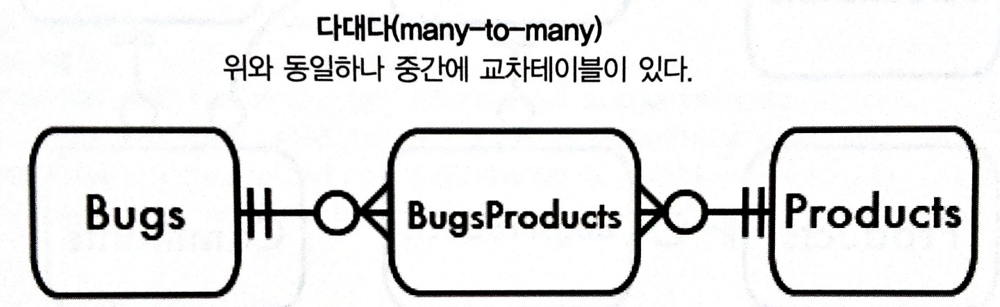
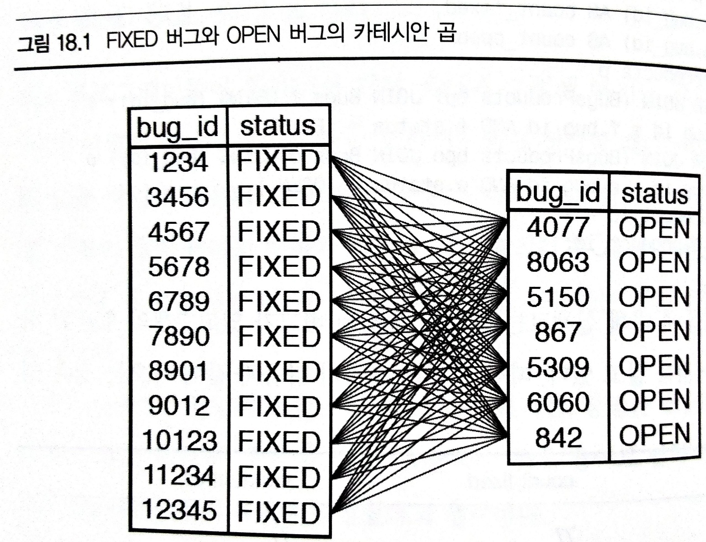

# SQL

- [SQL](#sql)
  - [SQL의 의미](#sql의-의미)
    - [SELECT 구문의 처리 순서](#select-구문의-처리-순서)
  - [SQL 설계 의도](#sql-설계-의도)
    - [SQL 쿼리 줄이기 필요한가](#sql-쿼리-줄이기-필요한가)
  - [참고 문헌](#참고-문헌)

## SQL의 의미

SQL(Structured Query Language)의 Query는 질의를 나타내며 좁은 뜻으로 SELECT 구문이다.

이름에서 알 수 있듯 SQL은 처음부터 데이터 검색을 중심으로 수행하기 위한 언어이다.

    여러 개의 테이블로부터 데이터를 조합해서 빠르게 가져와야하기 때문에

    여러 개의 테이블을 어떻게 읽을 것인가에 많은 주의를 기울여야 한다.

데이터 갱신하는 것은 부가적인 기능이다.

    INSERT와 UPDATE 같은 작업은 거의 레코드 단위로 발생하므로 성능상 문제가 되는 경우는 별로 없다.

### SELECT 구문의 처리 순서

키워드와 표현식을 묶어서 절이라고 표현한다.

어느 절이 먼저 실행되는지를 모르면 처리 내용이나 처리 결과를 예측할 수 없다.


1. FROM + JOIN 절

        테이블 전체를 가져온다.
        
2. WHERE 절

        조건에 맞는 결과만 갖도록 데이터를 필터링한다.

3. GROUP BY

        선택한 칼럼으로 그룹핑한다.

4. HAVING 절

        그룹핑 후에 각 그룹에 사용되는 조건절이다.

        HAVING 절의 조건을 WHERE 절에 사용할 수 있다면 바람직하다.

        HAVING 절은 각 그룹에 조건을 걸기 때문에 성능이 떨어지게 된다.

        cf. price > 10000는 조건을 각 그룹에 따로 거는 것보다 한 번에 거는 것이 좋기 때문이다.
        
            반면에 AVG(price) > 10000 처럼 집계함수를 사용하는 경우에는 각 그룹과 전체에서 평균이 다르게 동작함으로 HAVING 절이 필요하다.

5. SELECT 절

        여러 조건들을 처리한 후 남은 데이터에서 어떤 열을 출력해줄지 선택한다.

6. ORDER BY 절

        행의 순서를 어떻게 보여줄지 정렬해준다.

7. LIMIT 절

        몇개의 행을 보여줄지 선택한다.

## SQL 설계 의도

SQL의 개념은

    "간단한 것을 간단하게 하자"이다.

SQL의 장점은

    프로그래머가 아닌 사람도 사용할 수 있게 하자는 의도로 설계되었다.

    영어와 비슷한 구문으로 되어있어서 직관적으로 사용할 수 있다.

다만, 최근에는

    - SQL 표준에 복잡한 기능이 많이 들어가고,

    - 내부적인 움직임을 제대로 이해하지 못하면 성능이 제대로 나오지 않게 됨으로써
    
    처음 설계처럼 쉬운 언어가 아니게 되었다.

### SQL 쿼리 줄이기 필요한가

SQL 프로그래머들이 일하면서 가장 흔하게 수렁에 빠지는 경우는 다음과 같은 생각이다.

    어떻게 하나의 쿼리로 할 수 있을까

SQL 쿼리가 복잡하고 비용이 많이 든다고 생각하기 때문에, 두 개 이상의 SQL을 사용하면 두 배로 나쁘다고 생각한다.

이는 작업의 복잡도를 줄일 수 없지만, 방법을 단순화하고 싶어하는 생각이다.

    프로그래밍에서 한줄의 코드로 해치워야 하는 접근방법은 좋은 생각이 아니다.

모든 결과를 하나의 쿼리로 만들어내려고 시도할 때 나타나는 흔한 결과는 카테시안 곱(Cartesian product)이다.

    쿼리에 사용된 두 테이블에 이들의 관계를 제한하는 조건이 없을 때 발생

이런 제한 없이 두 테이블을 조인하면, A 테이블의 행 x B 테이블의 행과 같이 훨씬 많은 행이 나오게 된다.

주어진 제품에 대해 11개의 수정된 버그가 있고, 7개의 오픈된 버그를 출력해야하는 상황이다.
    
<center></center>

결과는 각각 버그가 77개라는 결과를 내었다.

<table>  
  <tr>
    <td>
<p>

```sql
SELECT p.product_id,
  COUNT(f.bug_id) AS count_fixed,
  COUNT(o.bug_id) AS count_open
FROM BugsProducts p
LEFT OUTER JOIN (BugsProducts bpf JOIN Bugs f USING (bug_id)) f
  ON (p.bug_id = f.bug_id AND f.status = 'FIXED')
LEFT OUTER JOIN (BugsProducts bpo JOIN Bugs o USING (bug_id)) o
  ON (p.bug_id = o.bug_id AND o.status = 'OPEN')
WHERE p.product_id = 1
GROUP BY p.product_id;
```
</p>
    </td>
    <td>
      
    </td>
  </tr>
</table>

해법은 한 번에 하나씩 접근한다.

```sql
-- Query A
SELECT p.product_id,
  COUNT(f.bug_id) AS count_fixed,    
FROM BugsProducts p
LEFT OUTER JOIN (BugsProducts bpf JOIN Bugs f USING (bug_id)) f
  ON (p.bug_id = f.bug_id AND f.status = 'FIXED')
WHERE p.product_id = 1
GROUP BY p.product_id;

-- Query B 
SELECT p.product_id,
FROM BugsProducts p
COUNT(o.bug_id) AS count_open
LEFT OUTER JOIN (BugsProducts bpo JOIN Bugs o USING (bug_id)) o
  ON (p.bug_id = o.bug_id AND o.status = 'OPEN')
WHERE p.product_id = 1
GROUP BY p.product_id;
```

<hr/>

## 참고 문헌

[SELECT 구문의 처리 순서](https://myjamong.tistory.com/172) ━ *마이자몽*

[SQL 쿼리 줄이기 필요한가](http://www.yes24.com/Product/Goods/5269099) ━ *「SQL AntiPatterns: Ch18. 스파게티 쿼리」*