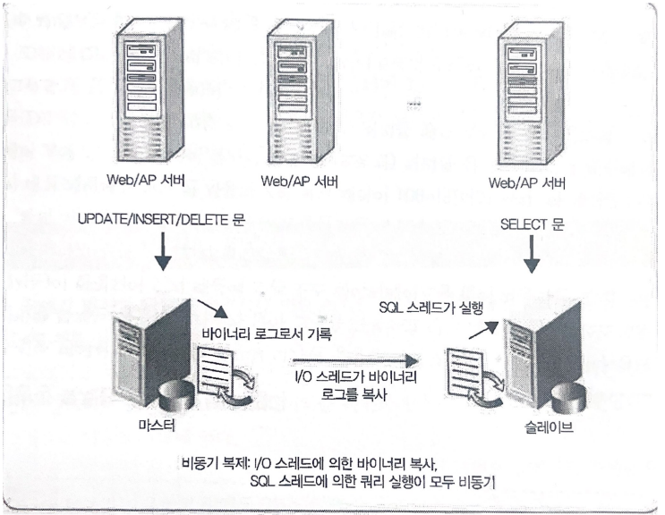
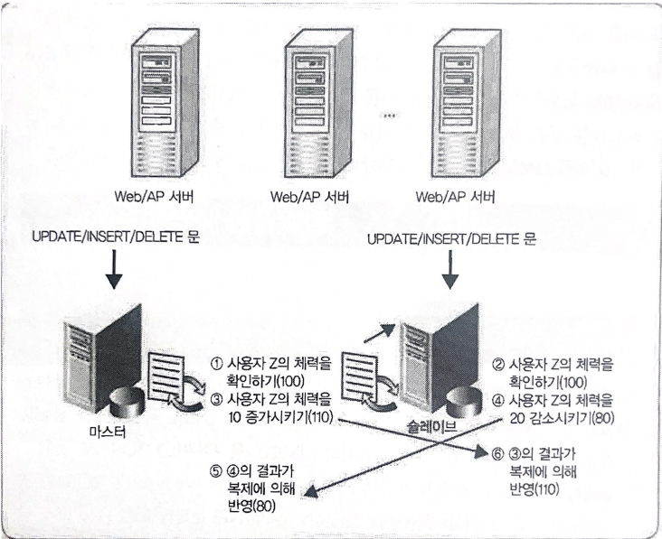

# 가용성과 데이터의 복제

## 들어가며
`데이터베이스가 크래쉬되었을 때 어떻게 하면 서비스를 다운시키지 않고 계속해서 운용할 수 있을까?`라는 질문의 대답을 할 수 있어야한다.

## 장애의 유형
장애(Failure)란 시스템이 제대로 동작하지 않는 상태를 말한다.

**첫 번째로, 트랜잭션 장애가 있다.**

트랜잭션 장애란 트랜잭션 수행 중 오류가 발생하여 정상적으로 수행을 계속할 수 없는 상태를 말한다.

원인은 다양한다. 트랜잭션의 논리적 오류, 잘못된 데이터 입력, 처리 대상 데이터의 부재 등..

**두 번째로, 하드웨어(디스크) 장애가 있다.**

하드웨어의 결함으로 정상적으로 수행을 계속할 수 없는 상태를 말하고, 하드웨어 이상으로 메인 메모리에 저장된 정보가 손실되거나 교착 상태가 발생하는 경우

**세 번째로, OS 장애가 있다.**

`Window의 블루 스크린` 또는 `Linux 커널 패닉`과 같은 OS 주변의 장애로 인해 서비스를 제공할 수 없게 되는 패턴이다.

일반적으로 장치 드라이버 버그가 있다. 장치 드라이버가 고부하 처리를 하다가 갑자기 디스크 액세스를 못하는 경우

**네 번째로, 소프트웨어(프로그램) 장애가 있다.**

`MySQL`과 같은 데이터베이스 프로그램의 폭주와 충돌처럼 소프트웨어 주변의 결함으로 인해 서비스를 제공할 수 없는 유형의 장애이다.

## 디스크 이중화로 데이터 손실 방지하기
- 데이터 손실 방지에 가장 초점을 둔 방식

### RAID
동일한 데이터를 두 개 이상의 HDD에 저장하는 방식
=> 하나가 망가져도 하나가 있자나~

## 서버 복제
- 트레이드 오프
  - 서버 하나가 망가져도 나머지에 동일한 데이터가 있으므로 정상 작동
  - 자원을 많이 소모한다는 단점이 있다.

### 동기 / 비동기
- 동기(synchronous)
  - 동기는 말 그대로 동시에 일어난다는 뜻이다. 요청과 그 결과가 동시에 일어난다는 약속이다. 바로 요청을 하면 시간이 얼마가 걸리던지 요청한 자리에서 결과를 주어야함
  - 요청과 결과가 한 자리에서 동시에 일어남
- 비동기(Asynchronous)
  - 비동기는 동시에 일어나지 않는다는 의미이다. 요청과 결과가 동시에 일어나지 않을거라는 약속
  - 요청한 그 자리에서 결과가 주어지지 않음

### 단방향 복제
- 가장 전통적인 방식
- MySQL에서 표준으로 사용되는 복제 기능
- `마스터`에서 갱신한 결과가 `슬레이브`에 `비동기`로 전파하는 유형의 복제
- `슬레이브`는 2가지 일을 한다.
  1. 바이너리 로그 수신
     - I/O 스레드
     - 네트워크 병목현상이 되는 경우가 적어 거의 동기처럼 동작
  2. 바이너리 로그 실행
     - SQL 스레드
     - 쿼리 실행은 디스크 엑세스를 해야지 되기 때문에 병목현상이 발생하기 쉽고 병목현상이 발생하면 지연을 초래한다.

- 단방향복제의 장애상황
  1. 마스터에서 생성한 바이너리 로그가 슬레이브에서는 마지막까지 수신되지 않은 상황
     - 슬레이브의 I/O 스레드가 `비동기`이기 때문에 발생
     - `바이너리 로그 수신`이 되는 도중에 마스터가 죽은 것
  2. 슬레이브에서의 바이너리 로그의 실행이 마지막까지 종료되지 않은 상황
     - 슬레이브의 SQL 스레드 지연으로 발생
     - 마스터가 죽으면 애플리케이션은 슬레이브를 마스터로 간주하는데 이 때 슬레이브에서 `바이너리 로그 실행`을 하고 있던 중이라면 기존의 마스터와 불일치 발생

### 단방향/준동기화
위에 내용에서 `바이너리 로그 수신`만 동기화 방식으로 사용하는 버전

슬레이브로 바이너리 로그 수신하는 동작은 확인응답이 반환될 때까지 기다린다. 따라서 클라이언트는 응답을 받았을 때 `바이너리 로그 수신`이 완료 된 것을 보장받는다.

마스터 손실에 의한 위험을 피할 수 있다.

But! 단점이 존재한다. 
=> 응답시간이 늦어진다.(바이너리 로그 수신을 기다려야하니까)

### 단방향/동기
점점 동기화 될 수록 손실의 의해 위험을 줄일 수 있지만

응답시간을 점점 늦어질 것이다.

### 양방향 복제
양방향 복제는 `마스터`와 `슬레이브`에서 둘다 `바이너리 로그 수신`과 `바이너리 로그 실행`을 한다.

즉 마스터=슬레이브라고 할 수 있다.

하지만 이러한 방식은 규칙이 필요하다. 예를 들어 `ID가 홀수인 것은 마스터 A에 건네고, ID가 짝수인 것은 마스터 B에 건네는` 식의 혼돈이 오지 않도록 애플리케이션 로직을 제어하는 것이 필요하다.

## 장애로 부터 복구 방법
1. 슬레이브 하드웨어 오류로 인해 슬레이브 내 데이터 유실 
=> 슬레이브 또는 마스터에서 데이터를 복원하거나 백업 데이터가 있다면 백업

2. OS 장애 등에 의해 데이터 자체는 있으나 데이터의 불일치가 있는 경우 
=> 장애가 발생해 손실되거나 불일치를 일으킨 슬레이브는 나중에 새로운 것을 다른 서버에서 다시 만들어 전체 복구시킨다.

위 `2번`방법은 매우 오랜 시간이 걸린다..

그래서 전체 데이터베이스를 복사하는 것이 아닌 **장애 시점과 현시점과의 차이만을 복구하는 방법**으로 변경되는 추세이다.

## 온라인 백업
백업할 때마다 데이터베이스를 비활성화할 수 없는 경우 온라인 백업을 선택한다.

온라인 백업을 할 경우 데이터베이스에 대한 모든 연결을 유지할 수 있지만,

트랜잭션 로그의 히스토리를 저장하기 위한 추가 디스크 공간이 필요하다.

**온라인 백업 동작과정**
1. 전체 데이터베이스가 파일로 복사된다.
2. 백업이 작성되는 동안 수행된 트랜잭션은 백업에 포함되지 않는다.
3. 이 트랜잭션은 아카이브 로깅을 통해 따로 백업을 작성하여 관리한다.

## 참고문헌
[데이터베이스 온라인 백업](https://www.ibm.com/docs/ko/license-metric-tool?topic=database-backing-up-db2)

[손상된 데이터베이스 복구](https://dataonair.or.kr/db-tech-reference/d-guide/dbms-2/?mod=document&uid=62487)