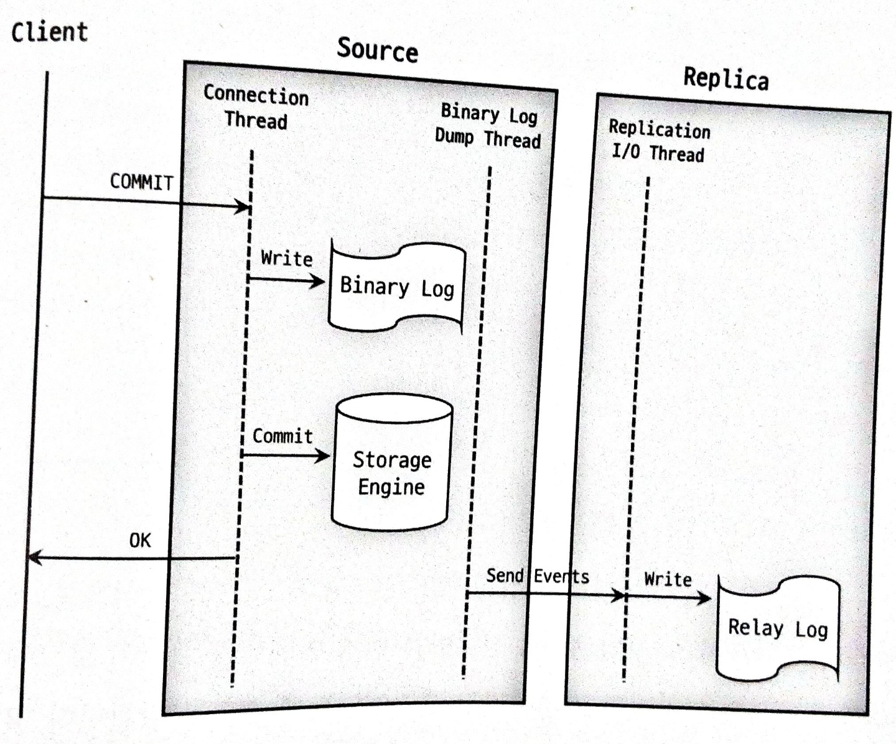
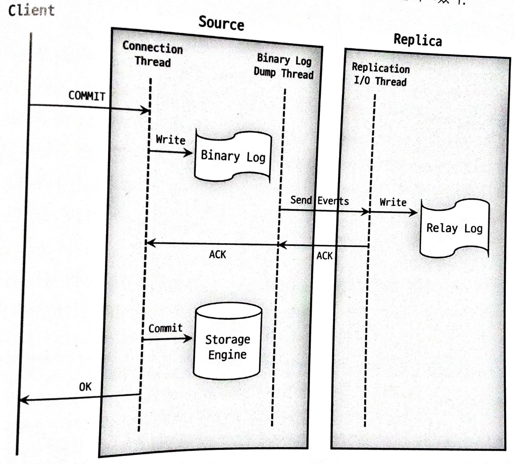
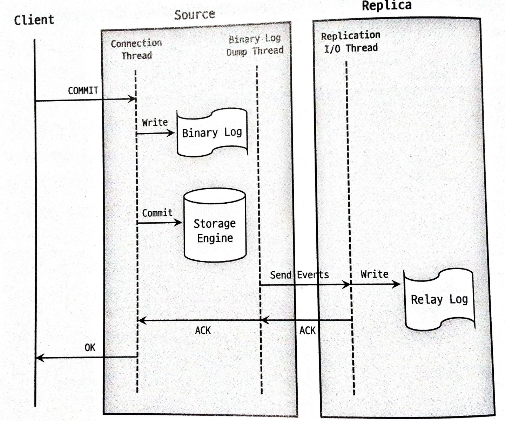

# 가용성과 데이터의 복제

- [가용성과 데이터의 복제](#가용성과-데이터의-복제)
  - [복제](#복제)
    - [복제 유형에는](#복제-유형에는)
    - [복제시 주의사항](#복제시-주의사항)
    - [복제에 사용되는 파일](#복제에-사용되는-파일)
    - [복제에 사용되는 스레드](#복제에-사용되는-스레드)
    - [복제에 사용되는 식별](#복제에-사용되는-식별)
  - [복제 동기화 방식](#복제-동기화-방식)
    - [비동기 복제](#비동기-복제)
    - [반동기 복제](#반동기-복제)
  - [참고 문헌](#참고-문헌)

## 복제

한 서버에서 다른 서버로 데이터가 동기화되는 것을 말한다.

복제(Replica) 서버를 구축하는 이점은 다음과 같다.

1. Scale-out
    
    서비스를 운영하다보면 사용자가 늘고, DB 서버로 유입되는 트래픽도 증가해 부하가 높아진다.

    동일한 데이터를 가진 DB 서버를 한 대 이상 더 사용할 수 있다면 

    애플리케이션으로부터 실행되는 쿼리들을 분산시킬 수 있다.

2. 데이터 백업

    사용자의 실수로 데이터가 삭제되면 서비스 운영에 영향을 줄 수 있다.

    동일한 서버 내에서 백업이 실행되는 경우 
    
        백업 프로그램과 DBMS가 서버의 자원을 공유해서 사용한다.

        이는 백업으로 인해 DBMS에서 실행중인 쿼리들이 영향을 받을 수 있다.

    이를 방지해 백업을 복제 서버에서 실행한다.

필자는 MySQL 복제를 알아볼 것이다.

### 복제 유형에는

    - 성능을 희생하여 데이터를 무결성을 증시하는 유형과

    - 데이터 소실의 리스크를 수용하며 성능을 추구하는 유형이 있다.

### 복제시 주의사항

    - 레플리카 서버는 하나의 소스 서버로만 설정 가능하다.

    - 소스-레플리카 서버 간의 데이터 동기화를 위해 레플리카는 읽기 전용으로 설정한다.

    - 레플리카가 불필요한 경우 바이너리 로그를 중지한다.

### 복제에 사용되는 파일

MySQL 서버에서 발생하는 모든 변경사항(이벤트)은 별도의 로그 파일(바이너리 로그)에 순서대로 기록된다. 

> 이벤트외에도 트랜잭션이라고도 표현하겠다.

MySQL 복제는 이 바이너리 로그를 기반으로 구현되었다.

1. 소스 서버에서 생성된 바이너리 로그가 레플리카 서버로 전송되고

2. 레플리카 서버에서 해당 내용을 로컬 디스크에 저장한 뒤 (복제)

3. 순차적으로 자신이 가진 데이터에 반영함으로써 소스-레플리카 서버 간 데이터 동기화가 이뤄진다. (쿼리 처리)

### [복제에 사용되는 스레드](https://slides.com/kimyongki/deck-1ca818/fullscreen)

- `바이너리 로그 덤프 스레드`

    1. 레플리카 서버는 소스 서버에 접속해 바이너리 로그 정보를 요청한다.

    2. 소스 서버에서는 레플리카 서버가 연결될 때 
        내부적으로 `바이너리 로그 덤프 스레드`를 생성해서 `바이너리 로그`의 이벤트를 레플리카 서버로 전송한다.

    3. `바이너리 로그 덤프 스레드`는 레플리카 서버로 보낼 각 이벤트를 읽을 때 일시적으로 `바이너리 로그`에 잠금을 수행하며, 

    4. 이벤트를 읽고난 후에는 바로 잠금을 해제한다.

- `레플리케이션 I/O 스레드`

    복제가 시작되면 레플리카 서버는 `I/O 스레드`를 생성하고, 복제가 멈추면 `I/O 스레드`는 종료된다.

    `I/O 스레드`는 소스 서버의 `바이너리 로그 덤프 스레드`로부터 `바이너리 로그`의 이벤트를 가져와 로컬 서버의 파일(릴레이 로그)로 저장하는 역할을 담당한다.
    
- `레플리케이션 SQL 스레드`

    SQL 스레드는 `I/O 스레드`에 의해 작성된 `릴레이 로그`의 이벤트들을 읽고 실행한다.

레플리카 서버에서 `I/O 스레드`와 `SQL 스레드`는 서로 독립적으로 동작한다.

    cf. SQL 스레드에서 이벤트를 데이터에 적용하는 게 느리더라도
        I/O 스레드는 무관하게 빠르게 소스 서버로부터 이벤트를 읽어올 수 있다.

또한, 레플리카 서버에서 동작들은 소스 서버의 동작과 별개로 진행되어 

레플리카 서버에 문제가 생기면 소스 서버는 전혀 영향을 받지 않는다.

단, 소스 서버에 문제가 생겨 레플리카 서버의 `I/O 스레드`가 정상 동작하지 않으면 

    복제가 되지 않아 소스 서버로부터 동기화되지 않는다.
    
    현재까지 복제해둔 릴레이 로그에 대한 SQL 스레드의 쿼리 처리는 문제없다.

### 복제에 사용되는 식별

소스 서버에서 발생한 바이너리 로그의 이벤트에 대한 식별이 반드시 필요하다.

복제가 설정된 레플리카 서버는 

    소스 서버의 어느 이벤트까지 로컬 디스크로 가져왔고, 또 적용했는지에 대한 정보를 관리하며

    소스 서버에 해당 정보를 전달해 그 이후의 바이너리 로그의 이벤트들을 가져와야 하기 때문이다.

## 복제 동기화 방식

### 비동기 복제

MySQL의 복제는 기본적으로 비동기 방식으로 동작한다.

비동기 방식이란

    소스 서버가 자신과 복제 연결된 레플리카 서버에서

    변경 이벤트가 전달되어 적용됐는지를 확인하지 않는 방식이다.

장점으로

    레플리카 서버로 전송되는 부분을 고려하지 않기 때문에 소스 서버에서 이벤트 처리에 있어서 빠른 성능을 보인다.
    
단점으로 

    소스 서버에 장애가 발생하면 레플리카 서버까지 전송되지 않아 누락된 이벤트가 존재할 수 있다.

    따라서, 레플리카 서버를 새로운 소스 서버로 승격시키는 경우 사용자는 누락된 이벤트가 있는지 수동으로 적용해야한다.

### 반동기 복제

반동기 방식이란

    일정 부분까지의 동기화만 보장한다는 의미이다.

1. 레플리카 서버가 소스 서버로부터 전달받은 변경 이벤트를 릴레이 로그에 기록 후 

2. ACK을 보내면

3. 이벤트를 완전히 커밋시키고 클라이언트에 결과를 반환한다.

    즉, 소스 서버에서 커밋되어 반환된 결과는 이벤트에 대해 적어도 하나의 레플리카 서버에 전송됬음을 보장한다.

    단, 전송을 보장할 뿐 복제된 이벤트가 레플리카 서버의 데이터에 적용되는 것을 보장하지는 않는다.    

비동기 방식과 비교하여

    레플리카 서버로부터 ACK을 기다리므로 이벤트 처리에 속도가 더 느릴 수 있다.

    소스 서버는 ACK을 기다리다 타임 아웃되면 자동으로 비동기 방식으로 전환된다.
    
소스 서버가 이벤트 처리 중 **어느 지점에서 레플리카 서버의 ACK을 기다리느냐**에 따라 

소스 서버에서 장애가 발생했을 때 사용자가 겪을 수 있는 문제 상황이 다르다.

<table>
    <tr>
        <th>AFTER SYNC</th>
        <th>AFTER COMMIT</th>
    </tr>
    <tr align="center">
        <td>MySQL 8.0부터 default</td>
        <td>MySQL 5.7까지 default</td>
    </tr>
    <tr>
        <td align="center">
            
        </td>
        <td align="center">
            
        </td>
    </tr>
    <tr>
        <td colspan="2" align="center">
1. 소스 서버에서는 각 이벤트를 바이너리 로그에 기록하고 난 후
        </td>
    </tr>
    <tr>
        <td>

2. 스토리지 엔진에 커밋하기 전 단계에서 레플리카 서버의 응답을 기다린다.

3. 레플리카 서버로부터 정상적으로 응답이 오면 
   소스 서버는 그때 스토리지 엔진을 커밋해서 이벤트에 대한 처리를 완전히 끝내고

        </td>
        <td>

2. 스토리지 엔진에 커밋을 진행하고

3. 레플리카 서버의 응답을 기다린다.

        </td>
    </tr>
    <tr>
        <td colspan="2" align="center">
5. 이벤트를 실행한 클라이언트에 그 처리 결과를 반환한다.
        </td>
    </tr>
</table>

🤔 커밋이란

    ...

`AFTER_COMMIT` 에는

- 소스 서버에 장애가 발생했을 때 팬텀 리드가 발생한다.

    팬텀 리드란
        
      2번의 과정이후 다른 세션에서 데이터 조회가 가능한데, 3번의 과정에서 소스 서버에 장애가 발생하게 된 경우

      새로운 소스 서버로 승격된 레플리카 서버에서 데이터를 조회할 때 다른 세션에서 조회해왔었던 데이터를 보지 못하는 현상이다.

- 장애가 발생한 소스 서버의 복구 처리

    팬텀 리드 이후 소스 서버를 재사용하였을 때

    장애가 발생한 이후 유입된 이벤트들은 소스 서버에서 커밋되어 실제 데이터 잘못 반영되었다.

    이를 수동으로 롤백해야했다.

`AFTER_SYNC`에는 위 두가지 발생하지 않으므로 좀 더 데이터 무결성이 강화된 방식이다.

## 참고 문헌

[복제](http://www.yes24.com/Product/Goods/105536168) ━ *「Real MySQL 8.0 2권: Ch18. 복제」*