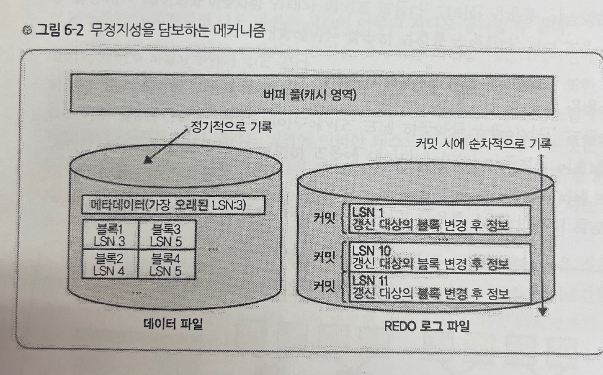

# 트랜잭션과 무결성, 무정지성

## 들어가며
이번 장에서는 트랜잭션 기능이 없으면 구체적으로 어떻게 곤란한지, 또 어떤 작업들이 늘어나는지를 배울 것이다.

## 용어 정리
> 트랜잭션
> 데이터베이스의 상태를 변화시키기 위해 수행하는 작업의 단위를 뜻한다.
> 간단한게 말해서 아래의 질의어(SQL)를 이용하여 데이터베이스의 접근하는 것을 의미한다.
> SELECT, INSERT, DELETE, UPDATE

> 트랜잭션이 안전하게 수행된다는 것을 보장하기 위한 4가지 성질
> ACID
> 1. 원자성(Atomicity)
>   - 트랜잭션과 관련된 작업들이 부분적으로 실행되다가 중단되지 않는 것을 보장
>   - Commit과 Rollback 명령어에 의해 보장 받는다.
> 2. 일관성(Consistency)
>   - 트랜잭션이 실행을 성공적으로 완료하면 언제나 일관성 있는 데이터베이스 상태를 유지하는 것을 의미한다.
>   - 무결성 제약이 모든 계좌는 잔고가 있어야 한다면 이를 위반하는 트랜잭션은 중단된다.
> 3. 격리성(Isolation)
>   - 트랜잭션을 수행 시 다른 트랜잭션의 연산 작업이 끼어들지 못하도록 보장
>   - 트랜잭션 밖에 있는 어떤 연산도 중간 단계의 데이터를 볼 수 없음
> 4. 지속성(Durability)
>   - 성공적으로 수행된 트랜잭션은 영원히 반영됨

> 데이터 무결성
> 데이터의 무결성은 데이터의 정확성, 일관성, 유효성이 유지되는 것을 말한다. 데이터의 무결성을 유지하는 것은 데이터베이스 관리시스템(DBMS)의 중요한 기능이며, 주로 데이터에 적용되는 연산에 제한을 두어 데이터의 무결성을 유지한다.

## 트랜잭션의 필요성

### 무결성

어중간한 상태로 복구하는 것이 아닌 일관성 있는 상태로 복구를 해야 데이터의 불일치도 생기지 않아 문제가 되지 않는다. 이것을 실현해 주는 구조가 `트랜잭션`이다.

어중간한 상태로 갱신이 확정되는 것이 아니라 전부 없었던 것으로 돌리는 것
트랜잭션의 `원자성(Atomicity)` 성질을 이용한 것이다.

BEGIN;(트랜잭션 시작)
UPDATE ..;
UPDATE ..;
COMMIT;(커밋)

이런식의 메커니즘으로 BEGIN후부터 COMMIT할 때까지의 사이에서 예외가 발생하면 그것을 캐치하여 ROLLBACK한다.

=> 이로써 UPDATE 도중에 에러가 발생해 UPDATE문을 취소하기 위해 UPDATE문을 다시 짜는 처리를 할 필요가 없다.

#### SQL문 레벨에서의 롤백
> 문제상황
> UPDATE문을 한 번만 실행하면 트랜잭은 불필요한가?

> 예를 들어 한번의 UPDATE문에서 1만 레코드를 업데이트 할 수 있다.
> 이 경우에 8000 레코드에서 데이터베이스가 다운 될 경우 어떻게 될 것인가

> 트랜잭션이 없는 경우
> 8000 레코드 까지는 UPDATE가 실행되었고, 8001 ~ 10000에서는 UPDATE가 실행 되지 않았을 것이다.

> 트랜잭션이 있는 경우
> 0 ~ 10000레코드 모두 UPDATE가 실행되지 않는다.

### 무정지성

트랜잭션 기능의 대표적인 두 번째 이점은 **무정지성의 향상**이다.

OS 장애 등의 서버 장애가 발생하여 그로부터 데이터베이스를 재기동한 때에

**장애 직전까지의 커밋 결과를 손실하지 않고 마치는 것**이 가능하다.

**[ 무정지성 로직 ]**

무정지성은 REDO 로그파일을 사용한다.

REDO 로그파일 안에는 LSN(Log Sequence Number)과 그 번호와 갱신 대상의 블록의 정보(갱신할 곳의 블록 ID 및 갱신할 곳의 위치 및 값)을 작성한다.

REDO 로그파일은 최신 커밋 정보를 가지고 있고, 데이터 파일은 오래된 정보를 가지고 있게 된다.

최신의 데이터 정보들은 캐시 영역에 있기 때문에 데이터 파일에 없더라도 애플리케이션에서 캐시 영역의 데이터를 읽으면 되기 때문에 모순이 발생하지 않는다.

> 문제 발생시(OS 장애) => 캐시 영역 데이터가 날아갈 경우
> 1. REDO로그 파일의 LSN과 데이터 파일을 일치시키는 작업을 진행한다.
> 2. 즉, 가장 오래된 LSN을 특정하고 거기서 부터 REDO 로그의 내용을 순서대로 대응한다.
> 3. 이로써 데이터 파일은 REDO의 최신 커밋과 동일해 진다.

## 잠금 메커니즘에 의한 배타 제어

다수의 사용자가 동일한 레코드에 동시에 엑세스할 수 있다.

10만원의 계좌가 있는데 동시에 한명은 3만원을 입금하고 한명은 5만원을 출금한다면, 여기서 배타 제어가 되지 않는 경우

통장은 13만원이거나, 5만원인 상황이 발생한다.

이런 동시에 엑세스하는 경우에 해결방법으로 **Lock방법**이 있다.

### 잠금의 범위
MyISAM의 경우 잠금의 범위가 **테이블**이다.

하지만 테이블 전체를 잠금할 경우 테이블의 다른 레코드들은 작업이 불가능하기 때문에 병렬성에서 매우 안좋은 효율을 이르킨다.

그래서 요즘 RDBMS에선 잠금의 범위가 **레코드**이다.

테이블에서 한 레코드를 잠금한 경우 다른 레코드는 엑세스가 가능하기때문에 병렬성 향상에 큰 공헌이 된다.

### 잠금 기간
잠근 기간은 트랜잭션의 종료(커밋 또는 롤백)시 까지 유지한다. 이것은 커밋 전에 잠금을 해제하면 나중에 롤백할 수 없는 위험이 있기 때문이다.

### 잠금 결론
트랜잭션을 사용하면 이런 잠금같은 것은 사용할 필요가 없다. 데이터베이스가 전부 대신해준다.

## 복제 및 트랜잭션
이전 장에서 데이터베이스 서버를 복제하는 것에 대해 배웠다.

이때 슬레이브는 `바이너리 로그 수신`, `바이너리 로그 실행` 뿐 아니라
`바이너리 로그의 위치 정보 기록`까지 한다.

이로써 슬레이브가 크래쉬가 발생 해도 마지막 커밋 시점을 다시 갱신할 수 있다.

