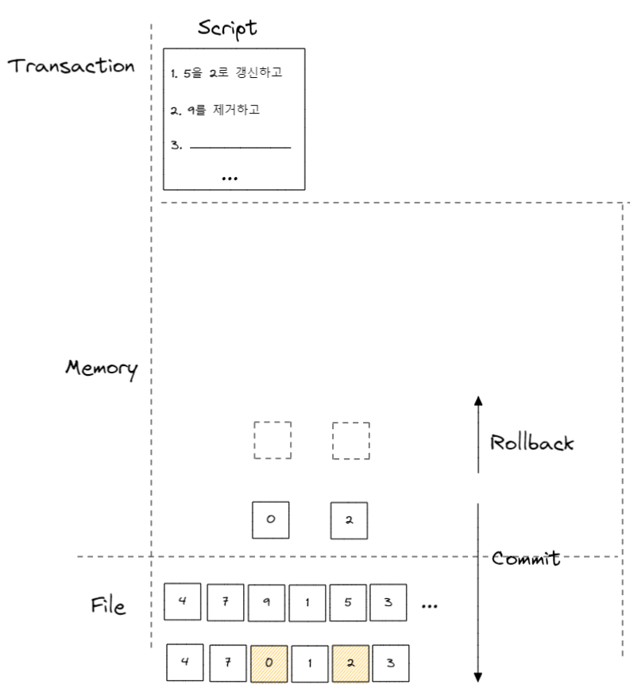
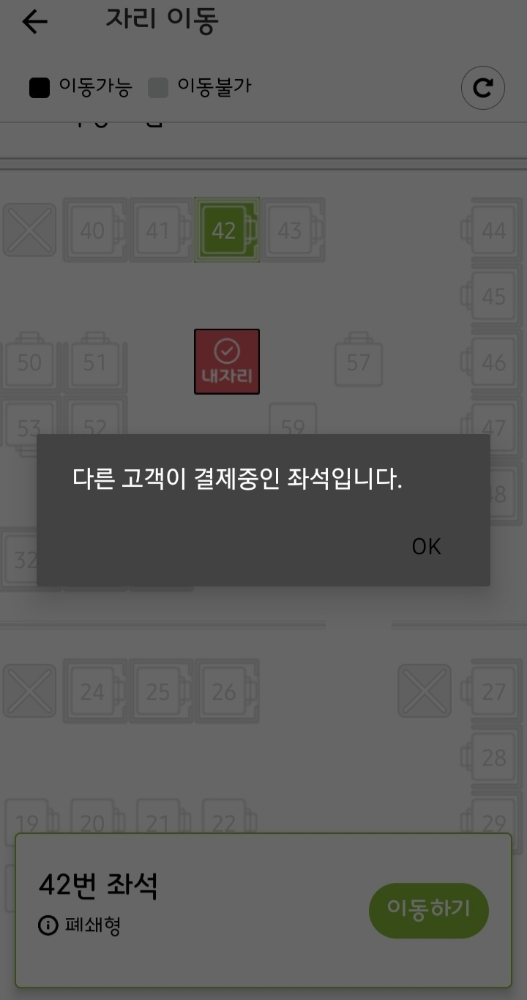

# 트랜잭션과 무결성·무정지성

- [트랜잭션과 무결성·무정지성](#트랜잭션과-무결성무정지성)
  - [점검요소](#점검요소)
  - [개요](#개요)
    - [사용 이유](#사용-이유)
    - [주의사항](#주의사항)
    - [단일 SQL문이라면 트랜잭션이 필요없는가](#단일-sql문이라면-트랜잭션이-필요없는가)
    - [ACID 특성](#acid-특성)
  - [참고 문헌](#참고-문헌)

## 점검요소

- 트랜잭션 기능이 없으면 어떻게 곤란한가
- 어떤 작업이 늘어나는가

## 개요

트랜잭션은 Script 이다.

    즉, Script 내에 1 → 2 → 3 각 단위가 절차적으로 수행된다.

    각 단위는 단일 SQL문을 의미한다.

### 사용 이유

데이터 부정합은

    SQL문 질의와 데이터 반영 사이에 장애가 발생하여

    질의의 의도대로 데이터 반영이 이뤄지지 않을 때를 말한다.

데이터 부정합을 방지하고자

    복구하는 작업을 애플리케이션에서 하거나
    
    사전에 방지하고자 테스트로 대비하는 것도 가능하겠지만

데이터 부정합을 간편하게 방지하고자 사용한다.

    원자성(Atomicity: All or Nothing)을 유지하기 위해

    트랜잭션 내의 모든 단위는 수행이 모두 성공적이거나, 반대로 모두 실패해야한다.

롤백(Rollback)은

    단위 중에 장애가 발생한 경우, 트랜잭션의 첫 단위로 돌아오는 것을 말한다.

트랜잭션에서 발생하는 장애란

    사용자 요청으로 인한 철회
    
      - 잘못된 입력
      - 일관성 제약 조건 위배

    DBMS로 인한 철회

      - 타임 아웃
      - 데드락

커밋(Commit)은

    트랜잭션 내 모든 단위가 성공적이면 디스크에 반영하는 것을 말한다.

### 주의사항

데이터베이스의 커넥션의 개수는 제한적이다.

    트랜잭션의 단위가 커넥션을 소유하는 시간이 길어질수록 여유 커넥션의 개수는 줄어들것이며

    어느 순간 커넥션을 기다려야하는 상황이 발생할 수 있다.

다음 내용은 사용자가 게시판에 게시물을 작성한 후 저장 버튼을 클릭했을 때

서버에서 처리하는 내용을 순서대로 정리한 것이다.

제외할 수 있는 단위를 제외해보자.

    1) 처리 시작
        
    → 데이터베이스 커넥션 생성(또는 커넥션 풀에서 가져오기)
    → 트랜잭션 시작

    2) 사용자의 로그인 여부 확인

    3) 사용자의 글쓰기 내용의 오류 여부 확인

    4) 첨부로 업로드된 파일 확인 및 저장

    5) 사용자의 입력 내용 DBMS에 저장
    
    6) 첨부 파일 정보를 DBMS에 저장

    7) 저장된 내용 또는 기타 정보를 DBMS에서 조회

    8) 게시물 등록에 대한 알림 메일 발송

    9) 알림 메일 발송 이력을 DBMS에 저장
        
    ← 트랜잭션 종료
    ← 데이터베이스 커넥션 반납

    10) 처리 완료

정답은

    1-4번은 트랜잭션이 필요없다.

    5-6번은 반드시 하나의 트랜잭션으로 처리해야한다.

    7번은 조회이므로 트랜잭션이 필요없다.

    8-9번은 별도의 트랜잭션으로 처리하지만, 네트워크 통신은 트랜잭션에서 배제하는 것이 좋다.

    통신되지 않는 상황이 발생하면 DBMS 까지 영향을 받기 때문이.

재정리하면

    1) 처리 시작

    2) 사용자의 로그인 여부 확인

    3) 사용자의 글쓰기 내용의 오류 여부 확인

    4) 첨부로 업로드된 파일 확인 및 저장

    → 데이터베이스 커넥션 생성
    → 트랜잭션 시작

    5) 사용자의 입력 내용 DBMS에 저장
    
    6) 첨부 파일 정보를 DBMS에 저장

    ← 트랜잭션 종료

    7) 저장된 내용 또는 기타 정보를 DBMS에서 조회

    8) 게시물 등록에 대한 알림 메일 발송

    → 트랜잭션 시작

    9) 알림 메일 발송 이력을 DBMS에 저장

    ← 트랜잭션 종료
    ← 데이터베이스 커넥션 반납

    10) 처리 완료

### 단일 SQL문이라면 트랜잭션이 필요없는가

필요하다.

    단일 SQL문이라도 내부에서 복수의 작업을 수행하기 때문이다.    

**단일 SQL문이 여러 레코드를 업데이트 하는 경우**

> 부제에서 복수의 작업 유추 가능

**단일 SQL문이 하나의 레코드만 업데이트 하는 경우**

인덱스가 있는 테이블이라면, 갱신 대상이 레코드 외에 인덱스도 해당 된다.

**단일 SQL문이 인덱스가 없는 테이블의 하나의 레코드만 업데이트 하는 경우**

하나의 레코드의 각 컬럼의 물리적 저장 위치가 다를 수 있다.

### ACID 특성

 **Atomicity 보장**

    트랜잭션에 의해 변경된 내용은 잠시 메모리에 유지하는데 

    트랜잭션에 오류가 발생하면 메모리를 날려버림으로써 이전 커밋된 디스크에는 간섭하지 않는다.

**Consistency 보장**

    트랜잭션 수행 전, 후에 데이터 모델의 제약 조건을 만족하는 것을 보장한다.

    cf. 칼럼 타입을 바꾼다고 하였을 때 이를 참조하는 테이블도 변경이 되어야한다.

    따라서 같은 트랜잭션이 실행됬을 때 불변하지 않아야한다.

단, Consistency 보장에 대한 관여는 애플리케이션에서 더 관여한다.

예로, ORM과 같은 validation으로 애플리케이션에서 사전에 방지한다.

**Isolation 보장**

<table>
    <tr>
        <td>

    여러 트랜잭션이 공통된 데이터를 조작할 때 locking으로 보장한다.

    단, 성능을 위해 병렬로 처리할 수 밖에 없는 상황에서는

    작업이 지속될 수 있는 대안도 제공된다.   
    

        </td>
        <td align="center">        
            
        </td>
    </tr>
</table>

locking 이란

    데이터를 읽거나 쓸때는 문을 잠궈서 다른 트랜잭션이 접근하지 못하도록한다.

    조작을 마치면 unlock을 통해 다른 트랜잭션이 접근할 수 있도록 허용한다.

lock과 unlock을 잘못 사용하여 deadlock 상태에 빠지지 않도록 주의해야한다.

**Durability 보장**

    성공적인 트랜잭션은 커밋을 통해 영속성을 보장받는다.

## 참고 문헌

[트랜잭션 개요](https://www.youtube.com/watch?v=7yuGlqPo8XQ&list=PLXvgR_grOs1DEoZFABFCjo7dsXt1BhVih&index=6) ━ *Youtube 「널널한 개발자」*

[트랜잭션 개요](https://victorydntmd.tistory.com/129?category=687930) ━ *Tistory 「victolee」*