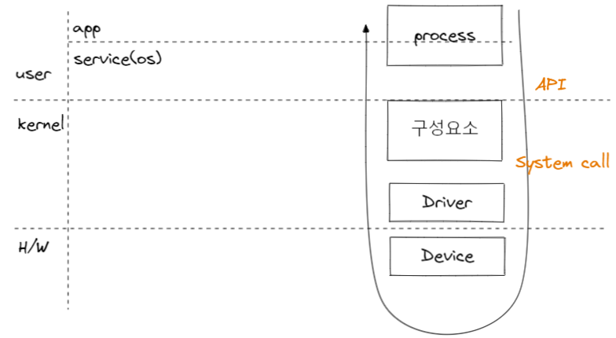

# 스토리지 기술의 변천과 데이터베이스에 끼치는 영향

- [스토리지 기술의 변천과 데이터베이스에 끼치는 영향](#스토리지-기술의-변천과-데이터베이스에-끼치는-영향)
  - [디스크 읽기 방식](#디스크-읽기-방식)
    - [순차 I/O vs 랜덤 I/O](#순차-io-vs-랜덤-io)
    - [HDD vs SSD](#hdd-vs-ssd)
  - [기술의 변천 및 향후 개선점](#기술의-변천-및-향후-개선점)
  - [참고 문헌](#참고-문헌)

## 디스크 읽기 방식

데이터베이스의 성능 튜닝은 

    어떻게 디스크 I/O를 줄이느냐가 관건이다.

이와 연관지어 디스크 성능은 

    디스크 헤더의 위치 이동 없이 얼마나 많은 데이터를 한 번에 기록하느냐에 결정된다.

### 순차 I/O vs 랜덤 I/O

순차 I/O는 3개의 페이지를 디스크에 기록하기 위해 

    1번 시스템 콜을 요청하여,
    
    디스크의 헤더를 1번 움직였다.

랜덤 I/O는 3개의 페이지를 디스크에 기록하기 위해 

    3번 시스템 콜을 요청하여,

    디스크의 헤더를 3번 움직였다.

지난 24주차의 내용을 기반으로 인덱스가 있을시 랜덤 I/O는 시스템 콜이 더 필요할 수 있다.

    단일 SQL문이 하나의 레코드만 업데이트 하는 경우 
    
    인덱스가 있는 테이블이라면, 갱신 대상이 레코드 외에 인덱스도 해당 된다.

시스템 콜이란

 

순차 I/O는 디스크의 헤더를 움직이지 않고 한번에 많은 데이터를 읽는다.

랜덤 I/O는 작업 부하가 더 크다.

### HDD vs SSD

컴퓨터에서 전자식 장치(CPU나 메인 메모리)에 비해 기계식 디스크 장치(HDD)는 제한적으로 발전했다.

    때문에 DBMS에는 항상 기계식 디스크 장치로부터 병목이 발생한다.

이를 대체하기 위한 전자식 디스크 장치(SSD)는 HDD의 데이터 저장용 원판과 이를 읽는 헤더를 제거하고, 플래시 메모리를 장착한다.

    원판을 기계적으로 회전시켜 데이터를 읽지 않아 빠르다.

플래시 메모리는 

    전원이 공급되지 않아도 데이터가 삭제되지 않고,

    메인 메모리(DRAM) > 플래시 메모리 > HDD의 속도를 나타낸다.

순차 I/O에서 HDD와 SSD는 성능이 비슷하다.

랜덤 I/O는 SSD가 훨씬 빠르다.

여기서 원판과 헤더가 없는 SSD에 순차 I/O와 랜덤 I/O에 작업처리량 차이가 없을 것으로 예측할 수 있지만 존재한다.

DBMS에서는 랜덤 I/O를 통해 작은 데이터를 읽고 쓰는 작업이 대부분이다.

따라서, 요즘 DBMS에는 대부분 SSD를 채택한다.

## [기술의 변천](https://slides.com/kimyongki/deck-6e8c70/fullscreen) 및 향후 개선점

디스크 장치가 전자식 장치로 전환됨으로써 병목현상이 디스크에서 CPU 및 네트워크로 옮겨갔다.

    PCI Express SSD: 10만 IOPS

    100Mbps 이더넷: 3.5만 IOPS
    1Gbps 이더넷:   10만 IOPS로 극복

    오래된 커널과 네트워크 카드를 사용하는 경우,
    네트워크 I/O를 하나의 CPU 코어에서 감당

레플리카 서버에서 소스 서버로 동기화를 병렬화 할 수 없어 병목현상이 발생하는데,

현재로써 하드웨어 강화로 극복한다는 점이 개선되어야한다.

## 참고 문헌

[복제](http://www.yes24.com/Product/Goods/105536167) ━ *「Real MySQL 8.0 1권: Ch08. 인덱스」*