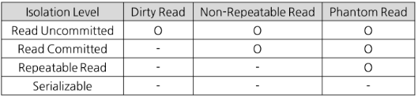

# 트랜잭션 격리 수준

## Isolation Level이란?
트랜잭션에서 일관성이 없는 데이터를 허용하도록 하는 수준

## Isolation Level의 필요성
- 데이터베이스는 ACID 같이 트랜잭션이 원자적이면서도 독립적인 수행을 하도록 한다.
- 그래서 Locking 이라는 개념이 등장한다.
  - 트랜잭션이 DB를 다루는 동안 다른 트랜잭션이 관여하지 못하게 막는 것
- 하지만 무조건적인 Locking으로 동시에 수행되는 많은 트랜잭션들을 순서대로 처리하는 방식으로 구현되면 DB의 성능은 떨어지게 된다.
- 반대로 응답성을 높이기 위해 Locking 범위를 줄인다면 잘못된 값이 처리 될 여지가 있다.
- 그래서 최대한 효율적인 Locking 방법이 필요하다.

## Isolation Level의 종류
> 뒤로 갈수록 트랜잭션 간의 데이터 격리 정도가 높아지며, 동시에 동시성도 떨어짐 
> 뒤로 갈수록 비용이 증가한다.

### Read Uncommitted(Level 0)
- SELECT 문장이 수행되는 동안 해당 데이터에 Shared Lock이 걸리지 않는 계층
- 트랜잭션에 처리중인 혹은 아직 커밋되지 않은 데이터를 다른 트랜잭션이 읽는 것을 허용한다.
> 즉, 어떤 사용자가 A라는 데이터를 B라는 데이터로 변경하는 동안 다른 사용자는 아직 완료되지 않는(Uncommitted) 트랜잭션이지만 변경된 데이터인 B를 읽을 수 있다.
- 데이터베이스의 일관성을 유지할 수 없다.

### Read Commited(Level 1)
- SELECT 문장이 수행되는 동안 해당 데이터에 Shared Lock이 걸리는 Level
- 트랜잭션이 수행되는 동안 다른 트랜잭션이 접근할 수 없어 대기하게 된다.
- Commit이 이루어진 트랜잭션만 조회할 수 있다.
> 즉, 어떤 사용자가 A라는 데이터를 B라는 데이터로 변경하는 동안 다른 사용자는 해당 데이터에 접근할 수 없다.
- 대부분의 SQL Server가 Default로 사용하는 Isolation Level

### Repeatable Read(Level 2)
- 트랜잭션이 완료될 때까지 SELECT 문장이 사용하는 모든 데이터에 Shared Lock이 걸리는 Level
- 트랜잭션이 범위 내에서 조회한 데이터의 내용이 항상 동일함을 보장한다.
> 즉, 다른 사용자는 트랜잭션 영역에 해당하는 데이터에 대한 수정 불가능
- MySQL에서 Default로 사용하는 Isolation Level

### Serializable(Level 3)
- 트랜잭션이 완료될 때까지 SELECT 문장이 사용하는 모든 데이터에 Shared Lock이 걸리는 Level
- 완벽한 읽기 일관성 모드를 제공한다.
> 즉, 다른 사용자는 트랜잭션 영역에 해당하는 데이터에 수정 및 입력이 불가능

## Isolation Level 이용시 발생하는 현상

- Dirty Read
  - 커밋되지 않은 수정 중인 데이터를 다른 트랜잭션에서 읽을 수 있도록 허용할 때 발생하는 현상
  - 어떤 트랜잭션에서 아직 실행이 끝나지 않은 다른 트랜잭션에 의한 변경 사항을 보게 되는 경우
- Non-Repeatable Read
  - 한 트랜잭션에서 같은 퀴리를 두 번 수행할 때, 그 사이에 다른 트랜잭션이 값을 수정 또는 삭제함으로써 두 쿼리의 결과가 상이하게 나타나는 비 일관성 현상
- Phantom Read
  - 한 트랜잭션 안에서 일정 범위의 레코드를 두 번 이상 읽을 때, 첫 번째 쿼리에서 없던 레코드가 두 번째 쿼리에서 나타나는 현상
  - 이는 트랜잭션 도중 새로운 레코드가 삽입되는 것을 허용하기 때문

## 참고문헌
[트랜잭션 격리수준 참고문헌](https://github.com/WeareSoft/tech-interview/blob/master/contents/db.md)

[트랜잭션 격리수준 참고문헌2](https://github.com/gyoogle/tech-interview-for-developer/blob/master/Computer%20Science/Database/Transaction%20Isolation%20Level.md)

