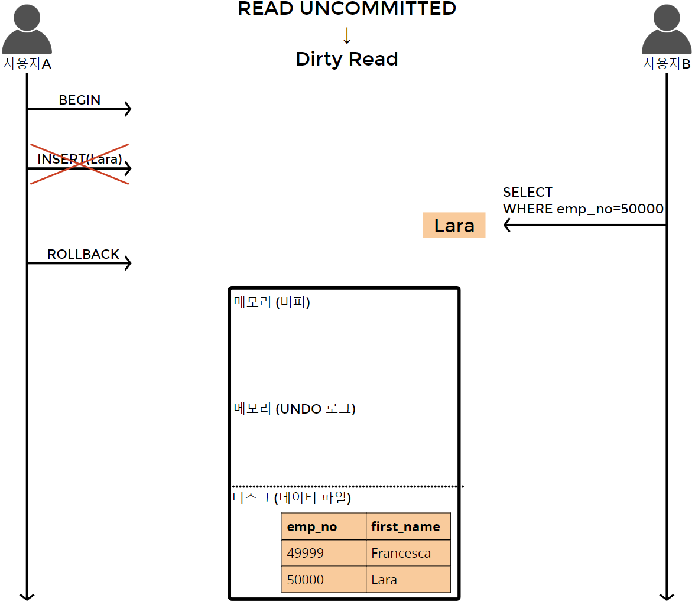
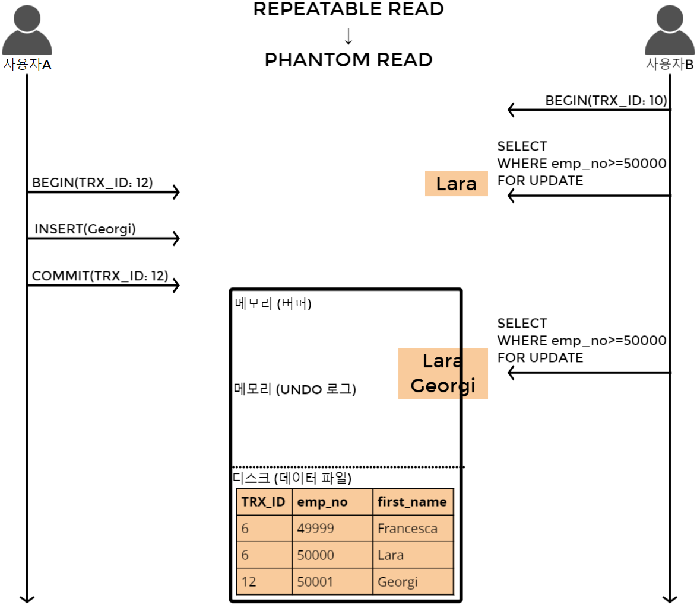
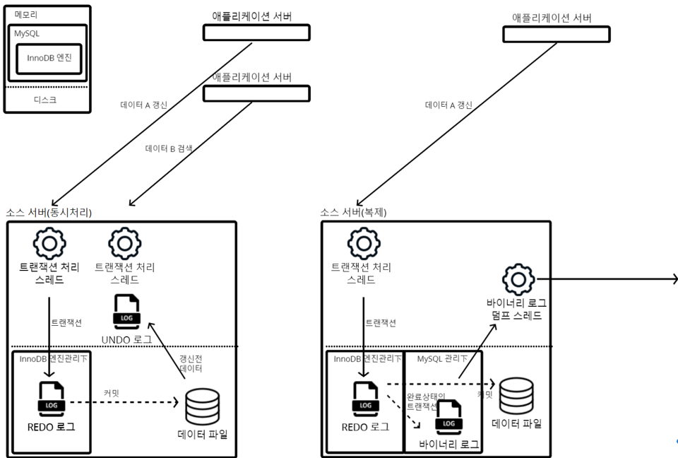
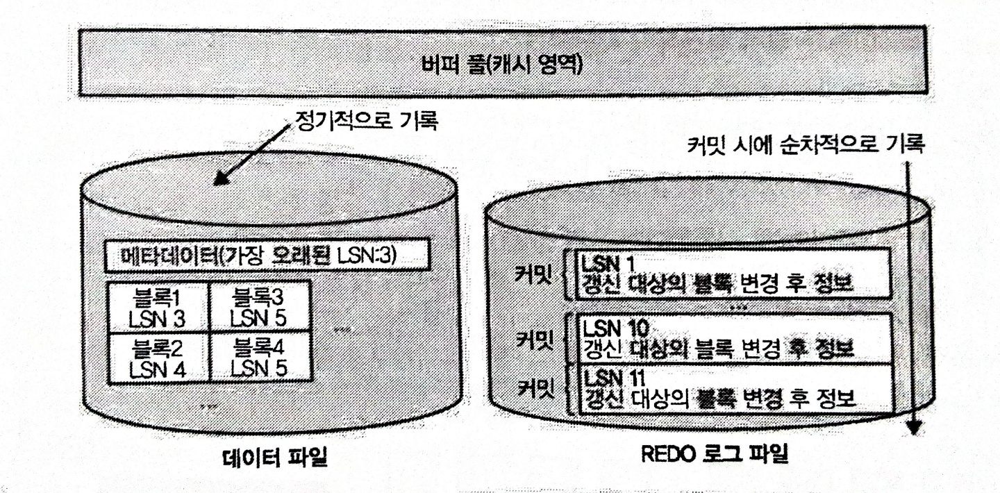

# [트랜잭션 격리수준](https://slides.com/kimyongki/deck-221254/fullscreen)

- [트랜잭션 격리수준](#트랜잭션-격리수준)
  - [본문](#본문)
    - [격리수준 별 문제](#격리수준-별-문제)
    - [격리수준](#격리수준)
  - [REDO vs UNDO vs 바이너리 로그](#redo-vs-undo-vs-바이너리-로그)
    - [로그 파일의 의의](#로그-파일의-의의)
    - [복구지점을 어떻게 식별하는가](#복구지점을-어떻게-식별하는가)
  - [참고 문헌](#참고-문헌)

## 본문

`MySQL5.5(InnoDB)`에는 격리 수준을 `MVCC(Multi Version Concurrency Control)`로 구현하였다.

    locking을 사용하지 않아, 지속된 작업이 가능하게 한다.

    하나의 레코드에 대해 2개의 버전이 디스크와 메모리(Undo 로그)에 유지되고, 격리 수준에 따라 달라진다.

### 격리수준 별 문제

소개하는 순서대로 `격리 수준`이 높아지며, 그만큼 `동시 처리 성능`도 떨어진다.

|                  | DIRTY READ | NON-REPEATABLE READ |    PHANTOM READ    |
| :--------------: | :--------: | :-----------------: | :----------------: |
| READ UNCOMMITTED |    발생    |        발생         |        발생        |
|  READ COMMITTED  |     X      |        발생         |        발생        |
| REPEATABLE READ  |     X      |          X          | 발생 (InnoDB X) |
|   SERIALIZABLE   |     X      |          X          |         X          |

<table>
    <tr>
        <th>DIRTY READ</th>
        <th>PHANTOM READ</th>
    </tr>
    <tr>
        <td>
            
        </td>
        <td>
            
        </td>
    </tr>
    <tr>
        <td>

    T2가 T1의 롤백 이전에 레코드를 조회하는 경우에
    
    재개된 T1이 커밋되어 온전해질수도, 커밋되지 않아 온전해지지 않을 수도 있다.

        </td>
        <td>

    T2가 여러번 조회하는 사이 T1이 갱신을 했다면

    레코드가 변하지는 않지만 추가되거나 삭제될 수 있는 현상이다.

        </td>
    </tr>
</table>

**NON-REPETABLE READ**

    T2가 여러번 조회하는 사이 T1이 갱신이후 커밋된다면, T2의 마지막 조회가 일관되지 않은 현상이다.

    T1의 커밋이전까지는 T2가 언두로그를 바라보지만
    T1의 커밋이후 T2가 디스크를 바라보게 되기 때문이다.

### 격리수준

트랜잭션을 T라고 하고 T1의 단위중 갱신구문이 있을때,

**READ UNCOMMITTED**

    변경된 레코드를 커밋과 롤백 여부에 상관 없이 T2에서 조회할 수 있다.

**READ COMMITTED**

    변경된 레코드를 커밋되기 전까지 T2에서 조회할 수 없다.

**REPEATABLE READ**

MySQL에서 사용하는 방식이다.

    트랜잭션마다 ID를 부여하여 현 ID보다 작은 ID에서 갱신한 레코드의 갱신 전 레코드를 조회할 수 있게 한다.

## REDO vs UNDO vs 바이너리 로그

<table>
    <tr>
        <th></th>
        <th>REDO 로그</th>
        <th>UNDO 로그</th>
        <th>바이너리 로그</th>
    </tr>
    <tr>
        <td>공통점</td>
        <td align="center"colspan="3">갱신</td>
    </tr>
    <tr>
        <td>상주하는 곳</td>
        <td>디스크</td>
        <td>메모리</td>
        <td>디스크</td>
    </tr>
    <tr>
        <td>관련 키워드</td>
        <td align="center" colspan="2">복구</td>        
        <td>복구(REDO 로그 없을 시) 
        복제
        </td>
    </tr>
    <tr>
        <td>저장 단위</td>
        <td>커밋, 롤백, 중간상태 여부</td>
        <td>커밋 이전 데이터</td>
        <td>완료상태의 트랜잭션(partial commit)</td>
    </tr>
    <tr>
        <td>필자의 비유🤪</td>
        <td>큐</td>
        <td>캐시</td>
        <td>필터링 된 큐</td>
    </tr>
    <tr>
        <td>장애 발생시</td>
        <td>트랜잭션 장애 기록 
        - 조작 실수 
        - 과부하에 따른 요청 타임아웃
        </td>
        <td>휘발</td>
        <td>기록된 내역까지 레플리카로 전송</td>
    </tr>
</table>

### 로그 파일의 의의

MySQL 서버에서 발생하는 트랜잭션을 별도의 로그파일에 순서대로 기록된다.

그림을 보면 `MySQL5.5(InnoDB)`에서는 REDO 로그가 해당 역할을 한다.

InnoDB엔진이 아닌 경우 바이너리 로그가 해당 역할을 한다.

트랜잭션-로그파일 간에는 비동기로 기록되는데 속도라는 성능을 보장하기 위함이고,

이후 로그파일-데이터 간에 커밋은 동기로 작업되는데 신뢰성을 보장하기 위함이다.

즉, 트랜잭션으로 부터 데이터에 반영되기 까지 로그 파일이라는 단계를 거치는 이유이다.

### 복구지점을 어떻게 식별하는가

> 지난 스터디 때 레플리카가 구성된 구조에서 온라인 백업이 가능하단걸 봤고,
> 
> 단일 서버로 구성된 구조에서 RAID로 온라인 백업이 가능한가에 대해 결론을 짓지 못했다.
> 
> RAID만 봤을시, 잘못된 데이터를 복제 해둘 수 있어 정상적인 복구는 할 수 없을 가능성이 있기 때문이다.

`MySQL5.5(InnoDB)`를 기준으로 가능함을 기술한다.

**REDO 로그**

데이터베이스 내용 자체가 손상된 경우에 사용한다.

완료상태의 트랜잭션이 생기면, 그때마다 LSN(Log Sequence Number)이 증가한다.    

완료상태의 트랜잭션, LSN, 갱신 대상의 데이터 블록을 REDO 로그에 기록한다.

    REDO 로그 파일에는 최신 커밋 정보가, 

    데이터 파일에는 커밋이 반영되기 전 정보를 가진다.

커밋 도중 장애가 발생 하면 어떻게 되는가?

    데이터 파일에 가장 오래된 LSN을 가진 데이터 블록부터 

    REDO 로그 파일의 완료상태의 트랜잭션을 순서대로 대응하여 디스크에 커밋한다.    

**UNDO 로그**

데이터베이스 내용 자체가 손상되지 않는다.

장애 발생 시점에 진행중이던 미완료상태의 트랜잭션이 단위이다.

미완료상태의 트랜잭션을 취소하여 이전 값으로 다시 돌아간다.

**바이너리 로그**

REDO 로그가 있을 경우 복구 역할은 하지 않는다고 판단한다.

REDO 로그가 없을 경우 복구 역할을 대체한다고 생각한다.

## 참고 문헌

[트랜잭션 격리수준](https://nesoy.github.io/articles/2019-05/Database-Transaction-isolation) ━ *「Nesoy 블로그」*

[Dirty read vs Phantom read](https://stackoverflow.com/questions/11043712/what-is-the-difference-between-non-repeatable-read-and-phantom-read) ━ *Stack overflow*

[REDO 로그 vs UNDO 로그](https://velog.io/@pk3669/Mysql-Redo-Undo-Log) ━ *velog*

[REDO 로그 vs UNDO 로그](https://www.topcit.or.kr/upload/edubox/essence/ess_ko_02/index.html) ━ *「TOPCIT 2영역: Ch12. 데이터베이스 복구」*

[REDO 로그 vs 바이너리 로그](http://jongguheo.blogspot.com/2019/10/binary-log-redo-log.html) ━ *Blogger*