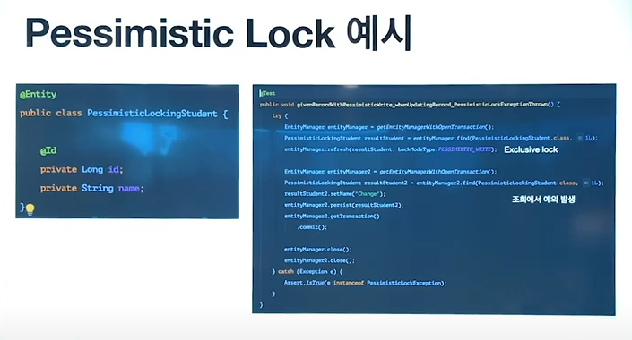

# 데이터베이스 락

## Lock이란?

데이터베이스의 **일관성**과 **무결성**을 유지하기 위해 **트랜잭션의 순차적 진행을 보장할 수 있는 직렬화 장치**

즉, 데이터의 일관성을 지키기 위해 **Lock(잠금)**을 걸고 이를 관리하는 것을 Locking 이라고 한다.

## 일관성, 무결성

둘의 의미는 매우 비슷하다. 무결성 안의 일관성이 있다고 생각한다.

- 무결성 : 데이터 값이 정확한 상태.
- 정확성 : 중복이나 누락이 없는 상태
- 일관성 : 원인과 결과의 의미가 연속적으로 보장되어 변화지 않는 상태

## Lock의 필요성

동시에 접근하여 수정하려고 할 때 데이터베이스의 일관성이 깨질 수 있다.

이를 방지하기 위해 트랜잭션의 격리수준과 비지니스 로직에 맞추어 Lock을 하여 데이터 출돌이 나지 않도록 하고,

충돌이 발생했다면 문제를 뒷처리를 하기 위함이다.

## Lock의 종류

Lock의 종류는 크게 두가지로 나눌 수 있다.

1. Optimistic Lock(낙관적 잠금)
2. Pessimistic Lock(비관적 잠금)

### Optimistic Lock

#### [ 정의 ]

- 레코드(데이터) 잠금을 사용하지 않는 RDBMS에서 사용되는 동시성 제어 방법
- 여러 트랜잭션이 동일한 데이터에 업데이트를 시도할 수 있고, 커밋할 때만 유효성이 검사된다.
- 데이터베이스 수준의 Roll-back이 없기에, 충돌 시 대안방안을 구현해야한다.
- Application Level(JPA) 에서 동작한다.
  - version 등의 컬럼을 추가해서 여러 트랜잭션 내에서 하나의 데이터에 중복을 업데이트를 확인한다.

#### [ 어느 상황에서 사용하면 좋을까? ]
- 동시 레코드 업데이트가 드물거나, Lock 오버헤드가 높은 것으로 예상될 때 사용
- 데이터베이스에 연결을 유지할 필요가 없는 대용량 시스템, 3계층 시스템
- 낙관적으로 바라로는 곳에서 사용한다.(DB 충돌이 거의 일어나지 않는다고 가정해야한다.)
- 아예 데이터 충돌이 나서 dirty read가 되더라도 무관한 곳에 사용한다.

#### [ 동작 원리 ]

#### [ JPA 예시 ]

### Pessimistic Lock

#### [ 정의 ]
- 레코드(데이터)에 대한 동시 업데이트를 방지한다.
- 하나의 트랜잭션이 레코드를 조회하기 시작하자마자 잠금이 설정된다.
  - 다음 사용자는 대기
- 트랜잭션 격리수준 `Reatable Read`또는 `Serializable` 격리 레벨에서 가능

#### [ 어느 상황에서 사용하면 좋을까? ]
- 이전 업데이트, 다음 업데이트를 직렬적으로 대기할 수 있는 경우 사용(짧은 업데이트 시간 간격)
- 데이터베이스를 직접 연결하는 시스템, 2계층 시스템
- 비관적(Data충돌이 분명 일어날 것이라는 가정을 한다.)
- 금융 등 항상 정확해야하는 곳에서 사용

#### [ 추가 설정 ]

1. Shared Lock : 다른 사용자가 동시에 읽을 수는 있지만, Update, Delete를 방지함
2. Exclusive Lock : 다른 사용자가 읽기, 수정, 삭제 모두 불가능하게 함

#### [ 동작 원리 ]

#### [ JPA 예시 ]

## Optimistic Lock vs Pessimistic Lock

|   | Optimistic Lock | Pessimistic Lock |
|---|---|---|
| 장점 | 데드락 가능성이 적으면 성능의 이점 | 충돌이 대한 오버헤드가 줄어든다.  무결성을 지키기 용이하다. |
| 단점 | 충돌이 발생하면 오버헤드가 발생 | 충돌이 발생하지 않으면 오버헤드가 발생 |

> 여담으로 Optimistic Lock의 성능이 많이 발생해서 기본적으로 Optimistic Lock을 사용하는 것이 좋다고한다~

## 참고문헌

[Lock 참고문헌1](https://sabarada.tistory.com/175)

[Lock 참고문헌2](https://itdar.tistory.com/390)

[Lock 참고문헌3](https://offbyone.tistory.com/225)

[Lock 참고문헌4](https://www.youtube.com/watch?v=w6sFR3ZM64c)

