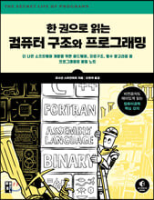
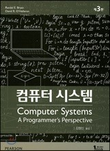
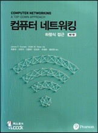
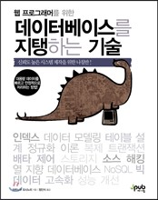

# Computer Science Study

면접을 위한 cs 스터디 저장소입니다.

## 교재

<div align="center">
<table>
      <tr>
            <th colspan="2">1-8주차</th>
            <th colspan="2">9-19주차</th>
            <th colspan="2">20-27주차</th>
      </tr>
      <tr>
            <td>
                  <a href="http://www.yes24.com/Product/Goods/98997716">
                        
                  </a>
            </td> 
            <td>
            <a href="http://www.yes24.com/Product/Goods/31950404">
                  
            </a>
            </td> 
            <td>
            <a href="http://www.yes24.com/Product/Goods/90640081">
                  
            </a>
            </td> 
            <td>
            <a href="http://www.yes24.com/Product/Goods/45543957">
                  
            </a>
            </td> 
            <td>
            <a href="http://www.yes24.com/Product/Goods/27893960">
                  
            </a>
            </td> 
      </tr>
</table>
</div>

## 주차별 주제

<div align="center">
<table>
      <tr>
            <th colspan="2">컴퓨터 구조</th>
            <th colspan="2">네트워크</th>
            <th colspan="2">데이터베이스</th>
      </tr>
      <tr>
            <td>
                  <a href="https://github.com/cs-study-org/cs-study/tree/main/01">1st</a>
            </td>
            <td>컴퓨터 내부의 언어체계</td>
            <td>
                  <a href="https://github.com/cs-study-org/cs-study/tree/main/09">9th</a>
            </td>
            <td>웹 브라우저</td>
            <td>
                  <a href="https://github.com/cs-study-org/cs-study/tree/main/20">20th</a>
            </td>
            <td>데이터베이스 필요성과 인덱스</td>
      </tr>
      <tr>
            <td>
                  <a href="https://github.com/cs-study-org/cs-study/tree/main/02">2nd</a>
            </td>
            <td>전자 회로의 조합 논리</td>
            <td>
                  <a href="https://github.com/cs-study-org/cs-study/tree/main/10">10th</a>
            </td>
            <td>프로토콜 스택 Part 1</td>
            <td>
                  <a href="https://github.com/cs-study-org/cs-study/tree/main/21">21th</a>
            </td>
            <td>테이블 설계와 릴레이션</td>
      </tr>
      <tr>
            <td>
                  <a href="https://github.com/cs-study-org/cs-study/tree/main/03">3rd</a>
            </td>
            <td>메모리 사용과 관리</td>
            <td>
                  <a href="https://github.com/cs-study-org/cs-study/tree/main/11">11th</a>
            </td>
            <td>프로토콜 스택 Part 2</td>
            <td>
                  <a href="https://github.com/cs-study-org/cs-study/tree/main/22">22th</a>
            </td>
            <td>SQL문의 특징과 잘 다루는 법</td>
      </tr>
      <tr>
            <td>
                  <a href="https://github.com/cs-study-org/cs-study/tree/main/04">4th</a>
            </td>
            <td>입출력과 네트워킹</td>
            <td>
                  <a href="https://github.com/cs-study-org/cs-study/tree/main/12">12th</a>
            </td>
            <td>LAN 어댑터</td>
             <td>
                  <a href="https://github.com/cs-study-org/cs-study/tree/main/23">23th</a>
            </td>
            <td>가용성과 데이터의 복제</td>
      </tr>
      <tr>
            <td>
                  <a href="https://github.com/cs-study-org/cs-study/tree/main/05">5th</a>
            </td>
            <td>데이터 구조와 처리</td>
            <td>
                  <a href="https://github.com/cs-study-org/cs-study/tree/main/13">13th</a>
            </td>
            <td>LAN 기기</td>
             <td>
                  <a href="https://github.com/cs-study-org/cs-study/tree/main/24">24th</a>
            </td>
            <td>트랜잭션과 무결성 ·무정지성</td>
      </tr>
      <tr>
            <td>
                  <a href="https://github.com/cs-study-org/cs-study/tree/main/06">6th</a>
            </td>
            <td>프로그래밍 언어 처리</td>
            <td>
                  <a href="https://github.com/cs-study-org/cs-study/tree/main/14">14th</a>
            </td>
            <td>방화벽</td>
            <td>
                  <a href="https://github.com/cs-study-org/cs-study/tree/main/25">25th</a>
            </td>
            <td>스토리지 기술의 변천과 데이터베이스에 끼치는 영향</td>
      </tr>
      <tr>
            <td>
                  <a href="https://github.com/cs-study-org/cs-study/tree/main/07">7th</a>
            </td>
            <td>시스템 프로그래밍</td>
            <td>
                  <a href="https://github.com/cs-study-org/cs-study/tree/main/15">15th</a>
            </td>
            <td>부하 분산</td>
            <td>
                  <a href="https://github.com/cs-study-org/cs-study/tree/main/26">26th</a>
            </td>
            <td>
                  트랜잭션 격리수준<br/>
                  REDO vs UNDO vs 바이너리 로그
            </td>
      </tr>
      <tr>
            <td>
                  <a href="https://github.com/cs-study-org/cs-study/tree/main/08">8th</a>
            </td>
            <td>병렬성과 비동기성</td>
            <td>
                  <a href="https://github.com/cs-study-org/cs-study/tree/main/16">16th</a>
            </td>
            <td>웹 서버, HTTP 버전별 특징</td>
            <td>
                  <a href="https://github.com/cs-study-org/cs-study/tree/main/27">27th</a>
            </td>
            <td>트랜잭션 locking</td>
      </tr>
      <tr>
            <td align="center" rowspan="3" colspan="2">-</td>  
            <td>
                  <a href="https://github.com/cs-study-org/cs-study/tree/main/17">17th</a>
            </td>
            <td>트랜스포트 계층 개요</td>
            <td align="center" rowspan="3" colspan="2">-</td>
      </tr>      
      <tr>            
            <td>
                  <a href="https://github.com/cs-study-org/cs-study/tree/main/18">18th</a>
            </td>
            <td>TCP 흐름제어 및 오류제어</td>
      </tr>
      <tr>            
            <td>
                  <a href="https://github.com/cs-study-org/cs-study/tree/main/19">19th</a>
            </td>
            <td>TCP 혼잡제어</td>
      </tr>
</table>      
</div>

## 규칙
1. 스터디원들은 PR이 올라오면, 실시간으로 피드백 답글을 남긴다.
2. 매주 스터디원 한명이 발표자료 1개와 발표를 맡는다.
3. 스터디 소요시간은 스터디(`4일`) + 리뷰(`2일`) + 발표(`일주일이되는 금일 또는 익일`)이다.
4. `merge` 하려면, 본인 PR 리뷰어들의 `approve`를 모두 얻은 뒤 본인이 한다.       
      4-1. `approve`할 시, PR 리뷰어들은 PR 당사자가 아래 항목을 맞췄는지 최종 확인한다.
      ```
      Q. 다른 스터디원의 파일이 PR 당사자의 파일에 포함되었는가? 
      A. 있다면 제거하는 커밋 올려야하므로 비승인

      Q. 리뷰어들의 피드백을 해결해주었나? 
      A. 해결되지 않았다면 비승인

      Q. 파일에 오탈자나 마크다운 일관성을 해치는 부분이 있나? 
      A. 있다면 비승인
      ```
      4-2. 최종확인 끝난다면, PR에 `approve`를 남긴다.
      ```
      1. PR > files changed에서 review changes 버튼을 누른다.
      2. approve 라디오버튼을 체크한 뒤, submit review 버튼을 누른다.
      3. 다음 사진과 같은 코맨트가 달렸다면 성공이다.
      ```
            
      
      

## [제출방법](https://github.com/cs-study-org/cs-study/wiki/제출방법)

링크를 확인해주세요.
